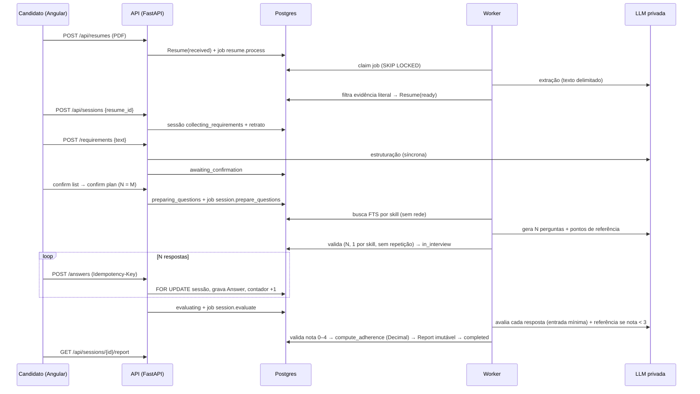

# Plano Técnico — Interview Reviewer (MVP de preparação para entrevistas técnicas com LLM local)

## 1. Resumo Executivo

O repositório é greenfield: só há um commit vazio em `develop`, sem README, sem código e sem
comandos declarados. Este plano cria o produto inteiro do MVP descrito no `spec.md` (140 IDs:
132 P1, 6 P2, 2 P3). Tem duas aplicações num monorepo: `backend/`, em Python 3.12 com FastAPI,
SQLAlchemy 2, Alembic, PostgreSQL 16 e um worker de jobs; e `frontend/`, em Angular (≥ 21,
standalone, Vitest e Playwright). O backend é o único que fala com a LLM, hospedada num
servidor privado do projeto com API compatível com OpenAI (vLLM em produção, Ollama em
desenvolvimento). Não há ajuste de pesos (LAC-01, LAC-02).

O backend concentra toda decisão: autenticação por sessão opaca em cookie, isolamento por dono
em toda consulta, máquina de estados da sessão, contagem de respostas, cobertura N = M e o
percentual calculado com `Decimal`. A saída da LLM é tratada como não confiável. Toda resposta
do modelo passa por validação determinística (evidência literal, contagem de perguntas, nota
inteira 0–4, fontes contidas na base) antes de ser persistida. PDF, preparação de perguntas e
avaliação rodam de forma assíncrona numa fila em Postgres, com estado visível e retomada. A base
de conhecimento é coletada antes, por CLI, só de fontes aprovadas, e consultada por busca
textual do Postgres, sem rede durante a sessão.

A privacidade é parte da arquitetura. Currículos ficam em volume privado, os logs passam por
filtro de redação e a entrada da avaliação é minimizada (EVAL-10). A exclusão de currículo,
sessão e conta é definitiva e retomável. Em produção, a rede não tem saída genérica: um proxy
com allowlist só libera Google OIDC e SMTP (KNOW-02). A validação do modelo é um CLI versionado,
cujo relatório é gate de inicialização em produção (MODEL-03).

Escopo grande: 95 tasks. A ordem de dependência forma as fases naturais (fundação → conta →
currículo → conhecimento → sessão/entrevista → avaliação/relatório → privacidade → validação do
modelo → operação → frontend). As ondas e os PRs são calculados pelo `check_plan.py`. Os P2
(OCR, export PDF, idioma/nível) e o P3 (comparação) entram como tasks próprias, que dependem
das P1 e não bloqueiam as P1.

## 2. Premissas e Lacunas

### 2.1 Decidido pelo humano (de `decisions.md`)

| ID | Decisão | Consequência no plano |
|---|---|---|
| LAC-01 | A: LLM em infraestrutura privada, acessada só pelo backend | DA-2: `backend/app/llm/client.py` com allowlist de hosts; compose de produção sem saída genérica (TASK-068) |
| LAC-02 | A: sem ajuste de pesos | `ModelVersion = modelo base + versão de configuração` (TASK-025); nenhum pipeline de treino |
| LAC-03 | B: processo e relatório de validação; metas aprovadas depois, como gate de release | `backend/config/model_targets.yaml` nasce com `approved_targets: null`, e produção recusa iniciar até existirem metas e relatório aprovado (TASK-025, TASK-067) |
| LAC-04 | A: rubrica 0–4, satisfatória ≥ 3, pesos iguais, percentual só sobre obrigatórias | `compute_adherence` (TASK-050) e rubrica no prompt do avaliador (TASK-051) |
| LAC-05 | A: > 20 obrigatórias impede o início | `TOO_MANY_REQUIRED_SKILLS` com `count`/`excess` (TASK-044) |
| LAC-06 | A: N = M | `planned_count = M` fixado em `confirm_plan` (TASK-044) |
| LAC-07 | A: não técnicos listados como não avaliados | campo `non_technical` da sessão e seção `non_evaluated` do relatório |
| LAC-08 | A: só inglês | detecção de idioma para CV e vaga (TASK-028, TASK-043); `supported_languages() == ["en"]` |
| LAC-09 | A: base curada coletada antes | CLI coletor (TASK-037) + busca FTS sem rede (TASK-038) |
| LAC-10 | A: pergunta gerada com "sem fonte verificada" | `questions.no_verified_source` (TASK-045) e rótulo no relatório |
| LAC-11 | A: exclusão de CV mantém retrato mínimo nas sessões | `snapshot_minimal` (TASK-061) |
| LAC-12 | A: exclusão imediata; backups expiram em até 30 dias | TASK-063 + rotina de backup com retenção de 30 dias (TASK-069) |
| LAC-13 | A: aceite de termos e política; dados nunca usados em treino | TASK-015, TASK-064 (conjunto sem dado de usuário) |
| LAC-14 | A: operador sem tela | nenhuma rota de administração; operação por CLI e configuração |
| LAC-15 | A: vínculo Google exige a senha local | `complete_link` (TASK-021) |
| LAC-16 | A: conta não verificada não entra | `EMAIL_NOT_VERIFIED` (TASK-017) |
| LAC-17 | A: 5 MB e 10 versões, configuráveis | `max_pdf_bytes`, `max_resumes_per_user` (TASK-003, TASK-029) |
| LAC-18 | B: cancelamento + expiração de 30 dias | TASK-041, TASK-049 |
| LAC-19 | A: `evaluation_failed` com retry pelo usuário | TASK-054, TASK-057 |
| LAC-20 | A: uma sessão não concluída por vez | índice único parcial `ux_one_open_session_per_user` (TASK-039) |
| LAC-21 | A: adicionar/editar/remover, marcado "informado pelo usuário" | `origin = user_provided` (TASK-032) |
| LAC-22 | A: junior / mid-level / senior / expert, opcional | enum `ExpectedLevel` (TASK-039) |
| LAC-23 | A: sem metas numéricas; medir e exibir status | eventos `timed` (TASK-006); status visível e polling no frontend |
| LAC-24 | A: mínimo 8 caracteres + senhas comuns | TASK-011 |
| LAC-26 | A: relatório concluído é imutável | trigger `reports_immutable` (TASK-040) e pipeline idempotente (TASK-054) |
| LAC-27 | A: 5.000 caracteres por resposta, configurável | `max_answer_chars` (TASK-047) |

### 2.2 Premissas assumidas (lacunas não bloqueantes)

| ID | Premissa | Reversibilidade | Onde impacta |
|---|---|---|---|
| LAC-25 | Textos das mensagens são os da seção 9 do spec, em inglês | alta | páginas do frontend, `backend/app/email/templates.py` |
| PR-1 | Acessibilidade WCAG 2.1 AA (premissa RNF07 do spec) | alta | todas as tasks `ui-puro` |
| PR-2 | OCR (P2) fica atrás de `ocr_enabled` (default `False`). Com `False` vale CV-06 (sem OCR). Com `True` valem OCR-01/02 | alta | TASK-031, TASK-034 |
| PR-3 | Após excluir o currículo, a sessão guarda `resume_name = null`, e o histórico mostra "Deleted resume" (o nome do arquivo pode conter nome pessoal) | alta | TASK-061, TASK-093 |
| PR-4 | Estruturação dos requisitos é síncrona na requisição (não é listada como assíncrona no RNF de performance). Com a LLM indisponível, devolve 503 sem mudar o estado | média | TASK-043, TASK-056 |
| PR-5 | E-mail enviado de forma síncrona. Com falha de SMTP, a conta/pedido fica e a UI oferece reenvio. Nenhum token é persistido em claro | média | TASK-014, TASK-016, TASK-018 |
| PR-6 | O "resumo geral" do relatório é um texto-modelo determinístico (sem LLM) | alta | TASK-053 |
| PR-7 | TTLs e limites padrão: sessão 168 h; verificação 24 h; redefinição 60 min; vínculo Google 15 min; 5 falhas de login em 15 min bloqueiam por 15 min | alta | TASK-003 |
| PR-8 | Comparação (P3) casa skills por nome normalizado (trim + minúsculas) | alta | TASK-060 |
| PR-9 | Idioma (LANG-01): a lista vem de `supported_languages()`, que no MVP devolve só `en` (único idioma com validação aprovada) | alta | TASK-042, TASK-087 |
| PR-10 | Matriz de navegadores: duas últimas versões de Chrome, Firefox, Safari e Edge (desktop e mobile) | alta | frontend |

### 2.3 Lacunas ainda abertas

Nenhuma. As metas numéricas de aprovação do modelo (LAC-03=B) ficam fora do MVP por decisão. O
gate reprova até que `approved_targets` seja preenchido pelo operador.

## 3. Ambiente e Comandos de Verificação

Repositório greenfield: nenhum manifesto existe ainda. Os comandos abaixo são os que as tasks de
scaffold **declaram** e têm de fazer funcionar (Done when de TASK-002 e TASK-070). A coluna
Origem aponta o arquivo e a task que o cria. Até a TASK-002 e a TASK-070 serem integradas, o
baseline do `run.py init` fica "cego" (ver Riscos).

| Alvo | Comando | Diretório | Relatório | Origem |
|---|---|---|---|---|
| Instalar dependências | `uv sync --frozen` | `backend` | — | `backend/uv.lock` (TASK-002) |
| Lint | `uv run ruff check . --output-format=concise` | `backend` | — | `backend/pyproject.toml` `[tool.ruff]` (TASK-002) |
| Typecheck | `uv run mypy app` | `backend` | — | `backend/pyproject.toml` `[tool.mypy]` (TASK-002) |
| Teste (suíte) | `uv run pytest -q` | `backend` | `reports/junit.xml` | `backend/pyproject.toml` `[tool.pytest.ini_options] addopts = "--junitxml=reports/junit.xml"` (TASK-002) |
| Teste (relacionado a arquivo) | `uv run pytest -q {files}` | `backend` | `reports/junit.xml` | idem |
| Build | `uv build` | `backend` | — | `backend/pyproject.toml` `[build-system]` hatchling (TASK-002) |
| Instalar dependências | `npm ci` | `frontend` | — | `frontend/package-lock.json` (TASK-070) |
| Lint | `npx ng lint` | `frontend` | — | `frontend/angular.json` + angular-eslint (TASK-070) |
| Typecheck | `npx tsc --noEmit -p tsconfig.app.json` | `frontend` | — | `frontend/tsconfig.app.json` (TASK-070) |
| Teste (suíte) | `npx ng test --watch=false` | `frontend` | `reports/junit.xml` | `frontend/angular.json` builder `@angular/build:unit-test` + `frontend/vitest-base.config.ts` (reporter junit) (TASK-070) |
| Teste (relacionado a arquivo) | `npx ng test --watch=false {include}` | `frontend` | `reports/junit.xml` | idem |
| Teste e2e (Playwright) | `npx playwright test {files}` | `frontend` | `reports/e2e-junit.xml` | `frontend/playwright.config.ts` (TASK-070) |
| Arquivo de regressão e2e | `frontend/e2e/regressao/{nome}.spec.ts` | — | — | convenção do pipeline |
| Build | `npx ng build` | `frontend` | — | `frontend/angular.json` (TASK-070) |
| Subir ambiente local | `docker compose up -d db mailpit && (cd backend && uv run alembic upgrade head && uv run uvicorn app.main:create_app --factory --port 8000 & uv run python -m app.jobs.worker &) && (cd frontend && npx ng serve --proxy-config proxy.conf.json)` | `.` | — | `docker-compose.yml` (TASK-001), `README.md` |
| URL da aplicação | `http://localhost:4200` | — | — | `frontend/proxy.conf.json` / `ng serve` padrão |
| Credenciais QA | `QA_USER_EMAIL`, `QA_USER_PASSWORD` | — | — | nomes de variáveis de ambiente; nunca valores |

- LLM local de desenvolvimento: `docker compose --profile llm up -d llm` (Ollama em
  `http://localhost:11434/v1`). Os testes nunca usam LLM real: usam o `FakeLLM` (TASK-023).
- Testes de integração do backend exigem o Postgres do compose (`docker compose up -d db`).

## 4. Estratégia de Testes

| Camada / pasta | Tipo exigido | Paralelo-seguro |
|---|---|---|
| `backend/tests/unit` | unit | sim |
| `backend/tests/integration` | integration | sim — cada sessão de pytest cria o próprio banco `ir_test_<uuid>` (DA-10) |
| `backend/tests/system` | integration | não — fluxo completo com rede bloqueada e worker em processo |
| `frontend/src/app` | unit | sim |
| `frontend/e2e` | e2e | não — porta fixa 4200 |

- Co-location: toda task cria o teste do próprio código. Testes de API ficam em
  `backend/tests/integration/api/` e cobrem o isolamento entre usuários (AUTH-16) de cada router.
- LLM: sempre `FakeLLM` (`backend/tests/fakes/fake_llm.py`, criado na TASK-023), com respostas
  roteirizadas por nome de tarefa (`resume_extraction`, `requirements_structuring`,
  `question_generation`, `clarification`, `answer_evaluation`, `reference_answer`).
- PDFs de teste são gerados no próprio teste com reportlab. Nenhum binário de fixture com dado
  real.
- Frontend: TestBed + `HttpTestingController`. Timers com `vi.useFakeTimers()` para polling.
- Não há `TESTING.md`. A tabela deriva das decisões DA-10 e DA-18.

## 5. Arquitetura Proposta

### 5.1 Visão de Componentes

```
frontend/ (Angular, SPA)            backend/ (FastAPI)                         infraestrutura
 core/http  (erro, interceptor) ─┐   api/        routers finos (8.1)            Postgres 16
 core/auth  (AuthApi, guards)    │   auth/       sessões, senha, tokens,        (dados + fila de jobs
 layout/    (shell)              │               throttle, Google OIDC           + base de conhecimento)
 shared/    (confirm dialog)     ├──►email/      SMTP síncrono                  volume privado storage/
 features/  auth, legal,         │   legal/      consentimento                  servidor LLM privado
            resumes, sessions,   │   resumes/    upload, PDF, idioma,           (OpenAI-compatible)
            reports, history,    │               extração, processamento, OCR   SMTP
            account              │   knowledge/  fontes, coletor CLI, busca     Google OIDC
                                 │   interviews/ estado, sessão, requisitos,
  /api via proxy (mesma origem) ─┘               perguntas, respostas, views
                                     evaluation/ nota, avaliador, referência,
                                                 pipeline
                                     reports/    conteúdo, PDF, comparação
                                     privacy/    exclusões
                                     llm/        cliente, framing, versão do modelo
                                     jobs/       fila, worker, registro
                                     model_validation/ dataset, métricas, runner (CLI)
```

Processos: `api` (uvicorn, `create_app`), `worker` (`python -m app.jobs.worker`), CLIs
`app.knowledge.collector` e `app.model_validation.runner`.

### 5.2 Fluxo Principal



Os estados seguem a seção 7 do spec. Toda transição passa por `transition()` (TASK-041), e o
frontend só exibe o estado devolvido.

### 5.3 Decisões Arquiteturais

| # | Decisão | Alternativas rejeitadas | Por quê |
|---|---|---|---|
| DA-1 | Monorepo com `backend/` e `frontend/`, README único na raiz | dois repositórios | uma feature, um PR por fase; comandos por diretório na seção 3 |
| DA-2 | LLM servida por servidor OpenAI-compatible privado (vLLM em produção, Ollama no dev), acessada só por `httpx` no backend, com `llm_allowed_hosts` e egress bloqueado em produção | SDK `openai`; LLM no navegador; provedor externo | LAC-01; mesma API em dev e prod; allowlist dá prova testável de KNOW-01 |
| DA-3 | FastAPI + SQLAlchemy 2 síncrono + psycopg 3 + Alembic + PostgreSQL 16 | async SQLAlchemy; SQLite | síncrono simplifica transações com `FOR UPDATE`; Postgres dá índice parcial, SKIP LOCKED, FTS e triggers |
| DA-4 | Fila de jobs na própria base (`jobs`, `SELECT ... FOR UPDATE SKIP LOCKED`) + processo worker; periódicos no mesmo worker | Celery/RQ + Redis | sem infraestrutura nova; payload só com IDs; retomada natural após falha |
| DA-5 | Sessão opaca em cookie HttpOnly (`ir_session`), hash SHA-256 no banco, CSRF double-submit (`XSRF-TOKEN`/`X-XSRF-TOKEN`, suporte nativo do Angular); Argon2id; throttle em tabela por conta e por HMAC do IP | JWT | logout invalida no servidor (AUTH-06); nada de token em `localStorage` |
| DA-6 | Google OIDC com Authlib, code flow + PKCE + state + nonce; callback no backend via proxy de mesma origem | implicit flow no frontend | segredo do cliente nunca sai do backend; vínculo controlado pelo backend (LAC-15) |
| DA-7 | Base de conhecimento em Postgres com `tsvector` gerado + GIN; busca por `websearch_to_tsquery` | pgvector/embeddings | sem modelo de embedding extra; KNOW-05 sem rede; suficiente para recuperação por skill |
| DA-8 | Defesa contra injeção: conteúdo não confiável delimitado (`wrap_untrusted`) + validação determinística pós-LLM (evidência literal, contagens, nota 0–4, fontes ⊆ base, recusa se esclarecimento vaza ponto de referência); a LLM não tem ferramentas nem acesso a dados além do prompt | filtro por palavras-chave | o modelo pode ser enganado; a validação não pode (CV-08, CV-94, PLAN-93, EVAL-16, KNOW-07) |
| DA-9 | `docker-compose.yml` de desenvolvimento com Postgres, Mailpit e Ollama (perfil `llm`) | instalar serviços na máquina | ambiente reproduzível |
| DA-10 | Testes de integração com banco próprio por sessão de pytest (`ir_test_<uuid>`, `alembic upgrade head`) | banco único compartilhado | tasks paralelas em worktrees não colidem |
| DA-11 | Observabilidade por logs JSON estruturados com filtro de redação; métricas como eventos (`timed`) | Prometheus/OpenTelemetry | LAC-23 sem metas; zero dependência nova; RNF08 aplicado num único ponto |
| DA-12 | E-mail síncrono por `smtplib` | e-mail via fila | a fila exigiria guardar o link com token em claro |
| DA-13 | Extração, lista de requisitos e conteúdo do relatório em JSONB validado por pydantic | tabelas normalizadas por item | snapshot/imutabilidade triviais; o relatório é um documento congelado (KNOW-08) |
| DA-14 | Arquivos em volume local privado (`storage_dir/<user_id>/<resume_id>.pdf`, 0600), sem rota de download | object storage | menos infraestrutura; exclusão por diretório do usuário |
| DA-15 | Detecção de idioma com `langdetect` (seed fixa) por blocos, inglês se ≥ 60% | pedir à LLM | determinístico e testável |
| DA-16 | OCR com `pytesseract` + `pdf2image` (tesseract/poppler no host), atrás de `ocr_enabled` | serviço externo de OCR | P2 sem afetar o P1 (PR-2) e dentro da infra privada |
| DA-17 | Export PDF com `reportlab` no backend | impressão do navegador; weasyprint | puro Python, sem dependências de sistema |
| DA-18 | Angular standalone, zoneless, signals, SCSS próprio sem biblioteca de UI; unit com Vitest pelo builder `@angular/build:unit-test`; Playwright para regressão | Karma (depreciado); Angular Material | stack atual do Angular; menos dependências |
| DA-19 | Idempotência de resposta: header `Idempotency-Key` + `UNIQUE(session_id, idempotency_key)` + `UNIQUE(question_id)` + `FOR UPDATE` na sessão | só desabilitar botão | INTV-06/INTV-90 garantidos no servidor |
| DA-20 | Imutabilidade por trigger em `answers` e `reports` | só convenção no código | RN03 e LAC-26 garantidos mesmo com bug |
| DA-21 | Status assíncrono por polling de 3 s no frontend | WebSocket/SSE | simples; LAC-23 sem meta de latência |

## 6. Reuso Obrigatório

Não há código anterior. O reuso é interno à feature: toda task usa os módulos abaixo em vez de
recriar o equivalente.

| Precisa de | Já existe em (após a task produtora) | Como usar |
|---|---|---|
| Configuração e limites | `backend/app/config.py` (TASK-003) | `get_settings()`; nunca ler `os.environ` direto |
| Sessão de banco | `backend/app/db.py` (TASK-004) | dependência `get_db`; `session_scope()` em jobs/CLI |
| Erros HTTP | `backend/app/errors.py` (TASK-005) | levantar `AppError` com código da seção 8.3; não criar `HTTPException` avulsa |
| Log e métricas | `backend/app/observability.py` (TASK-006) | `log_event` / `timed`, só com IDs e contagens |
| Enfileirar trabalho | `backend/app/jobs/queue.py` (TASK-008) | `enqueue(db, kind, {"<x>_id": str(id)})` |
| Registrar handler | `backend/app/jobs/registry.py` (TASK-009) | `register(kind, fn)` / `register_periodic(...)` |
| Usuário autenticado | `backend/app/api/deps.py` (TASK-013) | `Depends(get_current_user)` em toda rota privada |
| Recurso do dono | `get_owned_resume` (TASK-029), `get_owned_session` (TASK-042) | única forma de carregar currículo/sessão por id; outro dono → 404 |
| Chamar a LLM | `backend/app/llm/client.py` (TASK-023) | `get_llm_client().complete_structured(...)` + `run_with_attempts(..., settings.llm_max_attempts)` |
| Texto não confiável no prompt | `backend/app/llm/untrusted.py` (TASK-024) | `wrap_untrusted(label, text)` + `UNTRUSTED_RULES` no system prompt |
| Transição de estado | `backend/app/interviews/state_machine.py` (TASK-041) | `transition(session, to)`; nunca atribuir `status` direto |
| Resposta de sessão | `backend/app/interviews/views.py` (TASK-046) | toda rota de sessão devolve `build_session_view` |
| LLM em testes | `backend/tests/fakes/fake_llm.py` (TASK-023) | `FakeLLM({...})` via override de `get_llm_client` |
| Erro no frontend | `frontend/src/app/core/http/api-error.ts` (TASK-071) | `toApiError(err).code` para escolher a mensagem |
| Confirmação destrutiva | `frontend/src/app/shared/confirm-dialog.ts` (TASK-074) | todo excluir/cancelar usa `ConfirmDialog` |
| Padrão de página | primeira página pronta (`register-page`, TASK-075) | standalone component, `inject()`, signals, template em `.html`, erros com `role="alert"` |

## 7. Modelos de Dados

Todas as tabelas usam `id UUID` (uuid4) e timestamps `timestamptz` em UTC. (PII) marca dado
pessoal. Migrations lineares: `0001` → `0006` (`down_revision` explícito em cada task).

### 7.1 `jobs` (TASK-007, migration `0001_jobs`)
| Campo | Tipo | Obrig. | Notas |
|---|---|---|---|
| id | uuid | sim | PK |
| kind | varchar(64) | sim | `resume.process`, `session.prepare_questions`, `session.evaluate`, `account.purge` |
| payload | jsonb | sim | só identificadores (`{"resume_id": "..."}`); nunca texto de usuário |
| status | enum job_status | sim | queued, running, done, failed |
| attempts / max_attempts | int | sim | default 0 / 5 |
| run_after | timestamptz | sim | default now() |
| locked_at | timestamptz | não | |
| last_error_code | varchar(64) | não | nome da exceção, sem mensagem |
| created_at / updated_at | timestamptz | sim | |
Índice: `(status, run_after)`.

### 7.2 Conta (TASK-010, migration `0002_accounts`)
`users`: `email_normalized` varchar(320) UNIQUE (PII), `password_hash` text null,
`email_verified_at` null, `google_sub` varchar(255) UNIQUE null (PII), `terms_version`,
`privacy_version` varchar(32) null, `terms_accepted_at` null, `deletion_requested_at` null,
`created_at`.
`auth_sessions`: `user_id` FK CASCADE, `token_hash` char(64) UNIQUE, `created_at`, `expires_at`,
`revoked_at` null.
`one_time_tokens`: `user_id` FK CASCADE, `purpose` enum (verify_email, reset_password,
google_link), `token_hash` char(64) UNIQUE, `payload` jsonb null (`{"google_sub": ...}`),
`expires_at`, `used_at` null, `created_at`.
`login_throttles`: `key` varchar(128) PK (`account:<sha256(email_normalized)>` ou
`ip:<hmac(ip, throttle_secret)>`), `failures` int, `window_started_at`, `locked_until` null.

### 7.3 Currículo (TASK-026, migration `0003_resumes`)
`resumes`: `user_id` FK CASCADE, `filename` varchar(255) (PII), `uploaded_at`, `status` enum
(received, processing, ready, failed), `failure_code` varchar(64) null (NO_TEXT, NOT_ENGLISH,
CORRUPTED, PROTECTED, EXTRACTION_INVALID, LLM_UNAVAILABLE, OCR_NO_TEXT), `storage_key` varchar
null, `extracted_text` text null (PII), `extraction` jsonb null (PII), `updated_at`. Índice
`(user_id, uploaded_at desc)`.
`ExtractionItem` (pydantic): `id: str`, `kind: Literal["experience","education","skill"]`,
`fields: dict[str, str]` (title, organization, start, end, degree, institution, name,
description), `origin: Literal["explicit","inferred","user_provided"]`, `evidence: list[str]`
(vazia só quando `user_provided`).

### 7.4 Base de conhecimento (TASK-035, migration `0004_knowledge`)
`knowledge_items`: `source_id` varchar(64), `url` text UNIQUE, `title` text, `collected_at`,
`excerpt` text (≤ 2.000 caracteres), `skill_terms` text[], `search` tsvector GENERATED
(`to_tsvector('english', title || ' ' || excerpt || ' ' || array_to_string(skill_terms, ' '))`),
índice GIN em `search`. Sem dado de usuário.
Registro `backend/config/approved_sources.yaml`:
`sources: [{id, domain, urls: [https://...], skill_terms: [...]}]`.

### 7.5 Sessão (TASK-039, migration `0005_interviews`)
`interview_sessions`: `user_id` FK CASCADE, `resume_id` FK SET NULL, `resume_name` varchar null
(PII), `status` enum (collecting_requirements, awaiting_confirmation, preparing_questions,
preparation_failed, in_interview, evaluating, evaluation_failed, completed, cancelled, expired),
`language` varchar(8) default 'en', `interview_level` enum null, `snapshot` jsonb (lista de
`ExtractionItem`, PII), `snapshot_minimal` bool default false, `requirements_text` text null
(PII), `requirement_items` jsonb default '[]', `non_technical` jsonb default '[]', `proposal`
jsonb null, `planned_count` int null, `answered_count` int default 0, `preparation_attempts` int,
`evaluation_attempts` int, `last_activity_at`, `created_at`, `completed_at` null. Índice único
parcial `ux_one_open_session_per_user (user_id) WHERE status NOT IN
('completed','cancelled','expired')`.
`RequirementItem` (pydantic): `id`, `name`, `original_terms: list[str]`,
`classification: Literal["required","nice_to_have"]`, `level: ExpectedLevel | None` (junior,
mid-level, senior, expert), `pending_clarification: bool`, `clarification_question: str | None`.
`questions`: `session_id` FK CASCADE, `position` int, `skill_name`, `expected_level` null,
`text`, `reference_points` jsonb (lista de str, **nunca serializada fora do relatório**),
`sources` jsonb (lista de `SourceRef` copiada), `no_verified_source` bool; UNIQUE
`(session_id, position)`.
`messages`: `session_id` FK CASCADE, `role` enum (candidate, assistant), `kind` enum
(requirements, requirements_reply, clarification_request, clarification_reply, info),
`question_id` null, `content` text (PII), `created_at`.

### 7.6 Respostas, avaliações e relatório (TASK-040, migration `0006_assessments`)
`answers`: `session_id` FK CASCADE, `question_id` FK CASCADE UNIQUE, `content` text (PII),
`idempotency_key` varchar(64), `created_at`; UNIQUE `(session_id, idempotency_key)`; trigger
`answers_immutable` (BEFORE UPDATE → erro).
`evaluations`: `answer_id` FK CASCADE UNIQUE, `score` smallint CHECK 0..4, `justification` text,
`evidence_quotes` jsonb, `gap_explanation` text null, `reference_answer` jsonb null,
`model_version` varchar, `created_at`.
`reports`: `session_id` FK CASCADE UNIQUE, `content` jsonb, `adherence_percentage` numeric(4,1),
`model_version`, `rubric_version`, `created_at`; trigger `reports_immutable`.
`ReportContent` (pydantic, conteúdo congelado):
`summary`, `adherence_percentage` (string com 1 casa, ex. "62.5"), `disclaimer`,
`skills: [{skill, average, question_positions}]`, `items: [{position, skill, question, answer,
score, justification, evidence_quotes, satisfactory, gap_explanation, reference_answer: {text,
points, sources: [SourceRef], hypothetical_example, example_text} | null, no_verified_source}]`,
`unsatisfactory_items: [position]`, `non_evaluated: {nice_to_have: [...], non_technical: [...]}`,
`plan: {planned_count, skills}`, `model_version`, `rubric_version`, `sources_used: [SourceRef]`,
`completed_at`.

### 7.7 Configuração (`Settings`, TASK-003; variáveis com prefixo `IR_`)
| Campo | Default | Campo | Default |
|---|---|---|---|
| app_env | development | llm_base_url | http://localhost:11434/v1 |
| database_url | postgresql+psycopg://ir:ir@localhost:5432/interview_reviewer | llm_model | qwen2.5:7b-instruct (só dev) |
| storage_dir | ./storage | llm_allowed_hosts | ["localhost", "127.0.0.1", "llm"] |
| frontend_base_url | http://localhost:4200 | llm_timeout_seconds | 120 |
| cookie_secure | false | llm_max_attempts | 3 |
| session_ttl_hours | 168 | llm_config_version | cfg-1 |
| verification_ttl_minutes | 1440 | rubric_version | rubric-1 |
| reset_ttl_minutes | 60 | terms_version | terms-2026-09 |
| google_link_ttl_minutes | 15 | privacy_version | privacy-2026-09 |
| login_max_failures | 5 | max_pdf_bytes | 5242880 |
| login_lock_minutes | 15 | max_resumes_per_user | 10 |
| throttle_secret | (obrigatório) | max_answer_chars | 5000 |
| smtp_host / smtp_port | localhost / 1025 | session_expiry_days | 30 |
| smtp_user / smtp_password | vazio | max_required_skills | 20 |
| smtp_from | no-reply@interview-reviewer.local | min_resume_text_chars | 200 |
| smtp_starttls | false | ocr_enabled | false |
| google_client_id / google_client_secret | (obrigatórios para Google) | knowledge_sources_path | config/approved_sources.yaml |
| google_redirect_uri | http://localhost:4200/api/auth/google/callback | knowledge_min_rank | 0.01 |
| oidc_state_secret | (obrigatório) | model_targets_path | config/model_targets.yaml |
| job_poll_seconds | 2 | validation_reports_dir | validation_reports |

### 7.8 Conjunto de validação (TASK-064/065)
`backend/validation/v1/manifest.yaml`: `version`, `created_at`, `categories` (varied_pdfs,
missing_skills, synonyms, correct_rephrased, wrong_answers, verbosity_pairs, injection).
`backend/validation/v1/cases.jsonl`: um caso por linha `{id, category, provenance:
"synthetic"|"public", kind: "extraction"|"structuring"|"evaluation", input, expected}`. Pares
de verbosidade usam `pair_id`. `backend/validation_reports/<model_version_id>.json`:
`ValidationReport {model_version, rubric_version, dataset_version, generated_at, metrics:
{extraction_f1, structuring_accuracy, score_exact, score_within_one, score_mae,
verbosity_bias_rate, injection_success_rate}, meets_targets}`. `model_targets.yaml`:
`approved_targets: null | {<métrica>: {min|max: valor}}`.

## 8. Contratos

### 8.1 Contratos externos (API)

Base `/api`. JSON em inglês. Erro sempre `{"error": {"code": str, "message": str, "details":
object|null}}` (CT-3). Rotas privadas exigem cookie `ir_session` e, em métodos não-GET, header
`X-XSRF-TOKEN` igual ao cookie `XSRF-TOKEN`. Recurso de outro usuário → 404
`RESOURCE_NOT_FOUND`, sem corpo do recurso (AUTH-16).

**Auth local** (TASK-019; públicas salvo indicação)
- `POST /api/auth/register` `{email, password, accept_terms: true}` → 202 `{message, email_delivery: "sent"|"delayed"}` (corpo idêntico para e-mail novo ou existente) · 422 `PASSWORD_POLICY {violations}` · 422 `TERMS_NOT_ACCEPTED`.
- `POST /api/auth/verify-email` `{token}` → 200 `{message}` · 400 `LINK_INVALID`.
- `POST /api/auth/resend-verification` `{email}` → 202 `{message}` (neutro).
- `POST /api/auth/login` `{email, password}` → 200 `{user: Me}` + `Set-Cookie ir_session, XSRF-TOKEN` · 401 `INVALID_CREDENTIALS` · 403 `EMAIL_NOT_VERIFIED` · 429 `TOO_MANY_ATTEMPTS`.
- `POST /api/auth/logout` (privada) → 204, cookie removido e sessão revogada.
- `GET /api/auth/me` (privada, aceita aceite pendente) → 200 `Me {id, email, has_password, google_linked, terms_accepted}` · 401 `AUTH_REQUIRED`.
- `POST /api/auth/forgot-password` `{email}` → 202 `{message}` (neutro).
- `POST /api/auth/reset-password` `{token, new_password}` → 204 · 400 `LINK_INVALID` · 422 `PASSWORD_POLICY`.

**Google e conta** (TASK-022, TASK-063)
- `GET /api/auth/google/start` → 302 para Google.
- `GET /api/auth/google/callback?code&state` → 302 para `{frontend}/resumes` (signed_in), `{frontend}/accept-terms` (needs_terms, com sessão), `{frontend}/link-google?token=<pending>` (needs_link, sem sessão) ou `{frontend}/login?error=google_failed`.
- `POST /api/auth/google/link` `{token, password}` → 200 `{user: Me}` + cookies · 401 `INVALID_CREDENTIALS` · 400 `LINK_INVALID` · 429 `TOO_MANY_ATTEMPTS`.
- `POST /api/account/terms` (privada, aceita aceite pendente) `{accept: true}` → 204.
- `DELETE /api/account` (privada) → 200 `{message: "Your account and data were deleted. Backup copies expire within 30 days."}` + cookies removidos.

**Resumes** (TASK-033, TASK-061; privadas)
- `POST /api/resumes` multipart `file` → 201 `ResumeSummary {id, filename, uploaded_at, status, failure_code, failure_message}` · 413 `FILE_TOO_LARGE {limit_bytes}` · 415 `INVALID_PDF` · 409 `RESUME_LIMIT_REACHED {limit}`.
- `GET /api/resumes?status=ready|...` → 200 `ResumeSummary[]` (só do usuário, mais recente primeiro).
- `GET /api/resumes/{id}` → 200 `ResumeDetail {…ResumeSummary, items: ExtractionItem[] | null}`.
- `POST /api/resumes/{id}/items` `{kind, fields}` → 201 `ExtractionItem` · 409 `RESUME_NOT_READY`.
- `PATCH /api/resumes/{id}/items/{item_id}` `{fields}` → 200 `ExtractionItem`.
- `DELETE /api/resumes/{id}/items/{item_id}` → 204.
- `DELETE /api/resumes/{id}` → 204.

**Sessions** (TASK-055, TASK-056, TASK-057, TASK-062; privadas)
- `GET /api/interview-options` → 200 `{languages: [{code: "en", label: "English"}], levels: ["junior","mid-level","senior","expert"]}`.
- `POST /api/sessions` `{resume_id, language: "en", interview_level: ExpectedLevel|null}` → 201 `SessionView` · 409 `SESSION_IN_PROGRESS {session_id}` · 409 `RESUME_NOT_READY` · 422 `LANGUAGE_NOT_SUPPORTED`.
- `GET /api/sessions` → 200 `SessionSummary[] {id, created_at, status, resume_name|null, required_skills: [str], completed_at|null}`.
- `GET /api/sessions/{id}` → 200 `SessionView`.
- `POST /api/sessions/{id}/cancel` → 200 `SessionView` · 409 `INVALID_STATE`.
- `DELETE /api/sessions/{id}` → 204.
- `POST /api/sessions/{id}/requirements` `{text}` → 200 `SessionView` · 422 `EMPTY_REQUIREMENTS` · 409 `INVALID_STATE` · 503 `LLM_UNAVAILABLE`.
- `PUT /api/sessions/{id}/requirement-list` `{items: RequirementItemInput[]}` → 200 `SessionView`.
- `POST /api/sessions/{id}/requirement-list/confirm` → 200 `SessionView` (com `proposal`) · 422 `NO_REQUIRED_SKILLS` · 422 `TOO_MANY_REQUIRED_SKILLS {count, excess}` · 422 `PENDING_CLARIFICATION`.
- `POST /api/sessions/{id}/plan/confirm` → 200 `SessionView` (`preparing_questions`).
- `POST /api/sessions/{id}/preparation/retry` → 200 `SessionView` · 409 `INVALID_STATE`.
- `POST /api/sessions/{id}/answers` header `Idempotency-Key` `{question_id, content}` → 200 `SessionView` · 422 `EMPTY_ANSWER` · 422 `ANSWER_TOO_LONG {limit}` · 409 `QUESTION_ALREADY_ANSWERED {session}` · 409 `NOT_CURRENT_QUESTION {session}` · 409 `SESSION_CLOSED`.
- `POST /api/sessions/{id}/clarifications` `{text}` → 200 `{message: Message}` · 503 `CLARIFICATION_UNAVAILABLE` · 409 `SESSION_CLOSED`.
- `POST /api/sessions/{id}/evaluation/retry` → 200 `SessionView` · 409 `INVALID_STATE`.

`SessionView` (CT-40): `{id, status, created_at, language, interview_level, resume_name,
messages: [{id, role, kind, content, created_at}], requirements: {items: RequirementItem[],
non_technical: [str]} | null, proposal: {planned_count, skills} | null, counter: {planned,
answered, remaining} | null, current_question: {id, position, skill, text} | null, answered:
[{question_id, position, skill, question, answer}], report_available: bool}`. Nunca contém
`reference_points`, resposta esperada nem `sources` (INTV-14).

**Reports** (TASK-058, TASK-059, TASK-060; privadas)
- `GET /api/sessions/{id}/report` → 200 `ReportContent` (7.6) · 409 `REPORT_NOT_AVAILABLE`.
- `GET /api/sessions/{id}/report.pdf` → 200 `application/pdf` · 409 `REPORT_NOT_AVAILABLE`.
- `GET /api/reports/compare?a={id}&b={id}` → 200 `Comparison {a: {session_id, percentage, rubric_version, model_version}, b: {...}, common_skills: [{skill, a_average, b_average}], comparable, differences: [str]}` · 409 `REPORT_NOT_AVAILABLE`.

**Health**: `GET /api/health` → 200 `{"status": "ok"}` (pública, sem dado).

### 8.2 Contratos internos entre tasks

| ID | Contrato (assinatura / rota / tipo) | Produzido por | Consumido por |
|---|---|---|---|
| CT-1 | `get_settings() -> Settings` (campos da seção 7.7 do plan, prefixo de ambiente `IR_`) | TASK-003 (`backend/app/config.py`) | TASK-004, TASK-006, TASK-013, TASK-014, TASK-015, TASK-020, TASK-023, TASK-025, TASK-027, TASK-036 |
| CT-2 | `Base`, `get_db() -> Iterator[Session]`, `session_scope() -> Iterator[Session]` | TASK-004 (`backend/app/db.py`) | TASK-007, TASK-010, TASK-026, TASK-035, TASK-039 |
| CT-3 | `AppError(code: str, status: int, message: str, details: dict \| None = None)`; resposta `{"error": {"code", "message", "details"}}` | TASK-005 (`backend/app/errors.py`) | TASK-012, TASK-013, TASK-020, TASK-041 |
| CT-4 | `log_event(event: str, **fields: str \| int \| float \| bool \| None) -> None`; `timed(metric: str, **fields) -> ContextManager[None]` | TASK-006 (`backend/app/logging_setup.py`) | TASK-008, TASK-014, TASK-016, TASK-023, TASK-031, TASK-037 |
| CT-5 | `Job`, `JobStatus` (queued, running, done, failed) | TASK-007 (`backend/app/models/job.py`) | TASK-008 |
| CT-6 | `enqueue(db, kind: str, payload: dict[str, str], run_after: datetime \| None = None) -> UUID`; `claim_next(db) -> Job \| None`; `mark_done(db, job) -> None`; `mark_failed(db, job, error_code: str, retry: bool) -> None` | TASK-008 (`backend/app/jobs/queue.py`) | TASK-009, TASK-029, TASK-044, TASK-045, TASK-047, TASK-054, TASK-063 |
| CT-7 | `register(kind: str, handler: JobHandler)`, `register_periodic(name: str, every_seconds: int, fn: PeriodicFn)`, `JobHandler = Callable[[Session, dict[str, str]], None]`, `PeriodicFn = Callable[[Session], None]`; exceção `RetryableJobError` | TASK-009 (`backend/app/jobs/worker.py`) | TASK-031, TASK-045, TASK-049, TASK-054, TASK-063 |
| CT-8 | `User`, `AuthSession`, `OneTimeToken`, `TokenPurpose` (verify_email, reset_password, google_link), `LoginThrottle` | TASK-010 (`backend/app/models/account.py`) | TASK-012, TASK-013, TASK-015, TASK-026 |
| CT-9 | `hash_password(raw: str) -> str`; `verify_password(stored_hash: str, raw: str) -> bool`; `password_policy_violations(raw: str) -> list[Literal["too_short", "common"]]` | TASK-011 (`backend/app/auth/passwords.py`) | TASK-016, TASK-017, TASK-018, TASK-021 |
| CT-10 | `new_secret() -> str`; `hash_secret(raw: str) -> str`; `issue_one_time_token(db, user_id: UUID, purpose: TokenPurpose, ttl: timedelta, payload: dict[str, str] \| None = None) -> str`; `consume_one_time_token(db, raw: str, purpose: TokenPurpose) -> OneTimeToken` (levanta `AppError LINK_INVALID`) | TASK-012 (`backend/app/auth/tokens.py`) | TASK-013, TASK-016, TASK-018, TASK-021 |
| CT-11 | `create_auth_session(db, user: User, response: Response) -> None`; `revoke_auth_session(db, request: Request, response: Response) -> None`; `revoke_all_sessions(db, user_id: UUID) -> None`; `get_current_user(request, db) -> User` (401 AUTH_REQUIRED, 403 TERMS_REQUIRED); `get_current_user_pending_terms(request, db) -> User` | TASK-013 (`backend/app/auth/sessions.py`) | TASK-017, TASK-018, TASK-019, TASK-022, TASK-033, TASK-055, TASK-063 |
| CT-12 | `send_email(to: str, message: EmailContent) -> bool` (False se o SMTP falhar); `verification_email(link: str) -> EmailContent`; `password_reset_email(link: str) -> EmailContent`; `google_only_account_email() -> EmailContent` | TASK-014 (`backend/app/email/sender.py`) | TASK-016, TASK-018 |
| CT-13 | `record_consent(db, user: User) -> None`; `has_current_consent(user: User) -> bool` | TASK-015 (`backend/app/legal/consent.py`) | TASK-016, TASK-021, TASK-022 |
| CT-14 | `normalize_email(raw: str) -> str`; `register_local(db, email: str, password: str, accepted_terms: bool) -> EmailDispatch`; `resend_verification(db, email: str) -> EmailDispatch`; `verify_email(db, raw_token: str) -> None`; `EmailDispatch = Literal["sent", "delayed", "skipped"]` | TASK-016 (`backend/app/auth/registration.py`) | TASK-017, TASK-018, TASK-019, TASK-021 |
| CT-15 | `login_local(db, email: str, password: str, client_key: str) -> User` (levanta `INVALID_CREDENTIALS`, `EMAIL_NOT_VERIFIED`, `TOO_MANY_ATTEMPTS`) | TASK-017 (`backend/app/auth/login.py`) | TASK-019 |
| CT-16 | `request_password_reset(db, email: str) -> None`; `reset_password(db, raw_token: str, new_password: str) -> None` | TASK-018 (`backend/app/auth/password_reset.py`) | TASK-019 |
| CT-17 | `build_authorization_redirect(request: Request) -> RedirectResponse`; `exchange_callback(request: Request) -> GoogleIdentity(sub: str, email: str, email_verified: bool)` (levanta `GOOGLE_AUTH_FAILED`) | TASK-020 (`backend/app/auth/google_oidc.py`) | TASK-021, TASK-022 |
| CT-18 | `resolve_google_login(db, identity: GoogleIdentity) -> GoogleLoginResult(kind: Literal["signed_in", "needs_terms", "needs_link"], user: User \| None, pending_link_token: str \| None)`; `complete_link(db, pending_link_token: str, password: str) -> User` | TASK-021 (`backend/app/auth/google_accounts.py`) | TASK-022 |
| CT-19 | `LLMClient.complete_structured(task: str, system: str, user: str, output_model: type[T]) -> T` (levanta `LLMUnavailable`, `LLMInvalidOutput`); `run_with_attempts(fn: Callable[[], T], attempts: int, retry_on: tuple[type[Exception], ...]) -> T`; `get_llm_client() -> LLMClient` | TASK-023 (`backend/app/llm/client.py`) | TASK-030, TASK-043, TASK-045, TASK-048, TASK-051, TASK-052 |
| CT-20 | `wrap_untrusted(label: str, text: str) -> str`; `UNTRUSTED_RULES: str` | TASK-024 (`backend/app/llm/untrusted.py`) | TASK-030, TASK-043, TASK-045, TASK-048, TASK-051 |
| CT-21 | `ModelVersion(base_model: str, config_version: str, id: str)`; `current_model_version(settings) -> ModelVersion`; `assert_model_release_allowed(settings) -> None` (levanta `ModelNotApproved`) | TASK-025 (`backend/app/llm/model_version.py`) | TASK-053, TASK-054, TASK-067 |
| CT-22 | `Resume`, `ResumeStatus` (received, processing, ready, failed), `ExtractionItem` (pydantic, seção 7.3) | TASK-026 (`backend/app/models/resume.py`) | TASK-029, TASK-030, TASK-031, TASK-032, TASK-039, TASK-052 |
| CT-23 | `save_file(user_id: UUID, resume_id: UUID, data: bytes) -> str`; `read_file(key: str) -> bytes`; `delete_file(key: str) -> None` (idempotente); `delete_user_files(user_id: UUID) -> None` | TASK-027 (`backend/app/resumes/storage.py`) | TASK-029, TASK-031, TASK-061, TASK-063 |
| CT-24 | `looks_like_pdf(data: bytes) -> bool`; `extract_pdf_text(data: bytes) -> str` (levanta `PdfNoText`, `PdfCorrupted`, `PdfEncrypted`); `is_predominantly_english(text: str) -> bool` | TASK-028 (`backend/app/resumes/pdf.py`) | TASK-029, TASK-031, TASK-043 |
| CT-25 | `upload_resume(db, user: User, filename: str, data: bytes) -> Resume`; `list_resumes(db, user: User, status: ResumeStatus \| None = None) -> list[Resume]`; `get_owned_resume(db, user: User, resume_id: UUID, for_update: bool = False) -> Resume` (404 RESOURCE_NOT_FOUND) | TASK-029 (`backend/app/resumes/service.py`) | TASK-032, TASK-033, TASK-042, TASK-061 |
| CT-26 | `extract_resume_items(llm: LLMClient, text: str) -> list[ExtractionItem]` (levanta `ExtractionFailed`) | TASK-030 (`backend/app/resumes/extraction.py`) | TASK-031, TASK-067 |
| CT-27 | handler `process_resume(db, payload: {"resume_id": str}) -> None` para o kind `resume.process` | TASK-031 (`backend/app/resumes/processing.py`) | uso interno / rotas |
| CT-28 | `add_item(db, resume: Resume, data: ItemInput) -> ExtractionItem`; `update_item(db, resume: Resume, item_id: str, data: ItemInput) -> ExtractionItem`; `remove_item(db, resume: Resume, item_id: str) -> None` | TASK-032 (`backend/app/resumes/editing.py`) | TASK-033 |
| CT-29 | `ocr_pdf_text(data: bytes) -> str` (levanta `OcrNoText`) | TASK-034 (`backend/app/resumes/ocr.py`) | uso interno / rotas |
| CT-30 | `KnowledgeItem`; `SourceRef(url: str, title: str, collected_at: datetime, excerpt: str)` (pydantic) | TASK-035 (`backend/app/models/knowledge.py`) | TASK-037, TASK-038, TASK-051 |
| CT-31 | `load_approved_sources(path: Path) -> list[ApprovedSource(id: str, domain: str, urls: list[str], skill_terms: list[str])]` | TASK-036 (`backend/app/knowledge/sources.py`) | TASK-037 |
| CT-32 | `search_for_skill(db, skill: str, limit: int = 3) -> list[SourceRef]` | TASK-038 (`backend/app/knowledge/retrieval.py`) | TASK-045 |
| CT-33 | `InterviewSession`, `SessionStatus`, `Question`, `Message`, `MessageKind`, `RequirementItem` (pydantic), `ExpectedLevel` | TASK-039 (`backend/app/models/interview.py`) | TASK-040, TASK-041, TASK-042, TASK-043, TASK-044, TASK-045, TASK-046, TASK-047, TASK-048, TASK-049, TASK-061, TASK-062 |
| CT-34 | `Answer`, `Evaluation`, `Report` | TASK-040 (`backend/app/models/assessment.py`) | TASK-046, TASK-047, TASK-053, TASK-058, TASK-060, TASK-062 |
| CT-35 | `transition(session: InterviewSession, to: SessionStatus) -> None` (levanta `AppError INVALID_STATE` 409); `TERMINAL_STATUSES`; `AWAITING_CANDIDATE_STATUSES`; `can_transition(frm, to) -> bool` | TASK-041 (`backend/app/interviews/state_machine.py`) | TASK-042, TASK-043, TASK-044, TASK-045, TASK-047, TASK-048, TASK-049, TASK-054 |
| CT-36 | `start_session(db, user: User, resume_id: UUID, language: str, interview_level: ExpectedLevel \| None) -> InterviewSession`; `get_owned_session(db, user: User, session_id: UUID, for_update: bool = False) -> InterviewSession`; `list_sessions(db, user: User) -> list[InterviewSession]`; `cancel_session(db, session: InterviewSession) -> None`; `touch_activity(session: InterviewSession) -> None`; `supported_languages() -> list[str]` | TASK-042 (`backend/app/interviews/sessions.py`) | TASK-043, TASK-044, TASK-047, TASK-048, TASK-055, TASK-056, TASK-057, TASK-058, TASK-060, TASK-062 |
| CT-37 | `structure_requirements(db, llm: LLMClient, session: InterviewSession, text: str) -> None` | TASK-043 (`backend/app/interviews/requirements.py`) | TASK-056 |
| CT-38 | `replace_requirement_list(db, session: InterviewSession, items: list[RequirementItemInput]) -> None`; `confirmation_errors(items: list[RequirementItem], max_required: int) -> list[ConfirmationError]`; `confirm_requirement_list(db, session: InterviewSession) -> PlanProposal(planned_count: int, skills: list[str])`; `confirm_plan(db, session: InterviewSession) -> None` | TASK-044 (`backend/app/interviews/requirement_list.py`) | TASK-056 |
| CT-39 | handler `prepare_questions(db, payload: {"session_id": str}) -> None` para `session.prepare_questions`; `retry_preparation(db, session: InterviewSession) -> None` | TASK-045 (`backend/app/interviews/question_generation.py`) | TASK-056 |
| CT-40 | `build_session_view(db, session: InterviewSession) -> SessionView` (schema pydantic = corpo de `GET /api/sessions/{id}`, seção 8.1) | TASK-046 (`backend/app/interviews/views.py`) | TASK-055, TASK-056, TASK-057 |
| CT-41 | `submit_answer(db, session: InterviewSession, question_id: UUID, content: str, idempotency_key: str) -> None` | TASK-047 (`backend/app/interviews/answers.py`) | TASK-057 |
| CT-42 | `request_clarification(db, llm: LLMClient, session: InterviewSession, text: str) -> Message` (levanta `CLARIFICATION_UNAVAILABLE` 503) | TASK-048 (`backend/app/interviews/clarification.py`) | TASK-057 |
| CT-43 | `expire_inactive_sessions(db, now: datetime) -> int` registrado como periódico `session.expire` (a cada 3600 s) | TASK-049 (`backend/app/interviews/expiration.py`) | uso interno / rotas |
| CT-44 | `compute_adherence(scores_by_skill: Mapping[str, Sequence[int]]) -> AdherenceResult(skill_averages: dict[str, Decimal], percentage: Decimal)` | TASK-050 (`backend/app/evaluation/scoring.py`) | TASK-053, TASK-054 |
| CT-45 | `EvaluationInput(question: str, skill: str, expected_level: str \| None, reference_points: list[str], sources: list[SourceRef], answer: str)`; `evaluate_answer(llm: LLMClient, inp: EvaluationInput) -> EvaluationResult(score: int, justification: str, evidence_quotes: list[str], gap_explanation: str \| None)`; `is_dont_know(text: str) -> bool` | TASK-051 (`backend/app/evaluation/evaluator.py`) | TASK-052, TASK-054, TASK-067 |
| CT-46 | `build_reference_answer(llm: LLMClient, inp: EvaluationInput, snapshot: list[ExtractionItem]) -> ReferenceAnswer(text: str, points: list[str], sources: list[SourceRef], hypothetical_example: bool, example_text: str \| None)` | TASK-052 (`backend/app/evaluation/reference_answers.py`) | TASK-053, TASK-054 |
| CT-47 | `build_report_content(session: InterviewSession, questions: list[Question], answers: list[Answer], evaluations: list[Evaluation], adherence: AdherenceResult, model_version: ModelVersion, rubric_version: str) -> ReportContent` (schema da seção 7.6) | TASK-053 (`backend/app/reports/builder.py`) | TASK-054, TASK-059 |
| CT-48 | handler `run_evaluation(db, payload: {"session_id": str}) -> None` para `session.evaluate`; `retry_evaluation(db, session: InterviewSession) -> None` | TASK-054 (`backend/app/evaluation/pipeline.py`) | TASK-057 |
| CT-49 | `render_report_pdf(content: ReportContent) -> bytes` | TASK-059 (`backend/app/reports/pdf_export.py`) | uso interno / rotas |
| CT-50 | `compare_reports(a: Report, b: Report) -> Comparison(a_percentage, b_percentage, common_skills: list[SkillPair], comparable: bool, differences: list[str])` | TASK-060 (`backend/app/reports/compare.py`) | uso interno / rotas |
| CT-51 | `delete_resume(db, user: User, resume_id: UUID) -> None` | TASK-061 (`backend/app/privacy/resume_deletion.py`) | uso interno / rotas |
| CT-52 | `delete_session(db, user: User, session_id: UUID) -> None` | TASK-062 (`backend/app/privacy/session_deletion.py`) | uso interno / rotas |
| CT-53 | `delete_account(db, user: User, response: Response) -> None`; handler `purge_account(db, payload: {"user_id": str}) -> None` para `account.purge` | TASK-063 (`backend/app/privacy/account_deletion.py`) | uso interno / rotas |
| CT-54 | `load_dataset(path: Path) -> ValidationDataset`; `dataset_problems(ds: ValidationDataset, prompt_examples: list[str]) -> list[str]` | TASK-064 (`backend/app/model_validation/dataset.py`) | TASK-065, TASK-067 |
| CT-55 | `extraction_f1(expected: list[str], got: list[str]) -> float`; `structuring_accuracy(cases) -> float`; `score_agreement(pairs: list[tuple[int, int]]) -> ScoreAgreement(exact: float, within_one: float, mae: float)`; `verbosity_bias_rate(pairs: list[tuple[int, int]]) -> float`; `injection_success_rate(outcomes: list[bool]) -> float` | TASK-066 (`backend/app/model_validation/metrics.py`) | TASK-067 |
| CT-56 | `ValidationReport` (formato JSON de `validation_reports/<model_version_id>.json`) | TASK-025 (`backend/app/llm/model_version.py`) | TASK-067 |
| CT-57 | `interface ApiError { code: string; message: string; details?: Record<string, unknown> }`; `toApiError(err: unknown): ApiError`; `authInterceptor: HttpInterceptorFn` | TASK-071 (`frontend/src/app/core/http/api-error.ts`) | TASK-072, TASK-075, TASK-076, TASK-077, TASK-078, TASK-079, TASK-080, TASK-081, TASK-083, TASK-086, TASK-091 |
| CT-58 | `AuthApi` (register, verifyEmail, resendVerification, login, logout, me, forgotPassword, resetPassword, linkGoogle, acceptTerms, deleteAccount, googleStartUrl) e signal `currentUser`; guards `authGuard`, `guestGuard`, `termsGuard` | TASK-072 (`frontend/src/app/core/auth/auth-api.ts`) | TASK-073, TASK-075, TASK-076, TASK-077, TASK-078, TASK-079, TASK-080, TASK-081, TASK-095 |
| CT-59 | `ConfirmDialog` com inputs `title: string`, `message: string`, `confirmLabel: string` e outputs `confirmed`, `cancelled` | TASK-074 (`frontend/src/app/shared/confirm-dialog.ts`) | TASK-084, TASK-090, TASK-093, TASK-095 |
| CT-60 | `ResumeApi` (list(status?), get(id), upload(file), addItem, updateItem, removeItem, delete(id)) e tipos `ResumeSummary`, `ResumeDetail`, `ExtractionItem` | TASK-083 (`frontend/src/app/features/resumes/resume-api.ts`) | TASK-084, TASK-085, TASK-087 |
| CT-61 | `SessionApi` (options, start, list, get, cancel, delete, sendRequirements, replaceRequirementList, confirmList, confirmPlan, retryPreparation, answer(id, questionId, content, idempotencyKey), clarify, retryEvaluation) e tipos `SessionView`, `SessionSummary`, `RequirementItem` | TASK-086 (`frontend/src/app/features/sessions/session-api.ts`) | TASK-087, TASK-088, TASK-089, TASK-090, TASK-093 |
| CT-62 | `RequirementListEditor` inputs `items: RequirementItem[]`, `nonTechnical: string[]`, `proposal: PlanProposal \| null`, `error: ApiError \| null`; outputs `changed(items)`, `confirmList()`, `confirmPlan()` | TASK-088 (`frontend/src/app/features/sessions/requirement-list-editor.ts`) | TASK-090 |
| CT-63 | `InterviewPanel` input `view: SessionView`; output `viewChange(view: SessionView)` | TASK-089 (`frontend/src/app/features/sessions/interview-panel.ts`) | TASK-090 |
| CT-64 | `ReportApi` (get(sessionId), pdfUrl(sessionId), compare(a, b)) e tipos `ReportContent`, `Comparison` | TASK-091 (`frontend/src/app/features/reports/report-api.ts`) | TASK-092, TASK-094 |
| CT-65 | `create_app() -> FastAPI` com `GET /api/health` → 200 `{"status": "ok"}` | TASK-002 (`backend/app/main.py`) | uso interno / rotas |

Contratos de frontend espelham 8.1 campo a campo (nomes em snake_case preservados nos tipos TS).

### 8.3 Catálogo de erros

| Código | Quando ocorre | Mensagem ao usuário | HTTP |
|---|---|---|---|
| VALIDATION_ERROR | corpo/parâmetro inválido | "Please check the highlighted fields." | 422 |
| AUTH_REQUIRED | sem sessão válida | (redireciona para login) | 401 |
| TERMS_REQUIRED | aceite ausente ou desatualizado | (redireciona para aceite) | 403 |
| CSRF_FAILED | header XSRF ausente/divergente | "Your session expired. Please reload the page." | 403 |
| RESOURCE_NOT_FOUND | recurso inexistente ou de outro usuário | "Not found." | 404 |
| PASSWORD_POLICY | senha < 8 ou comum | "Password must have at least 8 characters and must not be a common password." | 422 |
| TERMS_NOT_ACCEPTED | cadastro sem aceite | "You must accept the Terms of Use and the Privacy Policy." | 422 |
| INVALID_CREDENTIALS | e-mail/senha errados (inclusive vínculo Google) | "Invalid e-mail or password." | 401 |
| EMAIL_NOT_VERIFIED | conta local não verificada | "Please verify your e-mail before signing in. Resend verification e-mail?" | 403 |
| TOO_MANY_ATTEMPTS | throttle de login | "Too many attempts. Please try again later." | 429 |
| LINK_INVALID | link expirado, usado ou inválido | "This link is invalid or has expired. Request a new one." | 400 |
| GOOGLE_AUTH_FAILED | Google cancelado/falhou | "Google sign-in failed or was cancelled. Please try again." | 302 → login |
| INVALID_PDF | não é PDF pelo conteúdo, ou 0 byte | "Please upload a valid PDF file." | 415 |
| FILE_TOO_LARGE | acima de `max_pdf_bytes` | "The file exceeds the 5 MB limit." | 413 |
| RESUME_LIMIT_REACHED | 10 versões guardadas | "You have reached the limit of 10 resumes. Delete one to upload another." | 409 |
| RESUME_NOT_READY | versão não `ready` | "This resume is not ready yet." | 409 |
| SESSION_IN_PROGRESS | já há sessão não concluída | "You already have an interview in progress. Resume or cancel it to start a new one." | 409 |
| LANGUAGE_NOT_SUPPORTED | idioma sem validação aprovada | "This language is not supported yet." | 422 |
| INVALID_STATE | ação não permitida no estado atual | "This action is not available at this step." | 409 |
| EMPTY_REQUIREMENTS | requisitos vazios | "Please paste the job requirements for the position you are preparing for." | 422 |
| NO_REQUIRED_SKILLS | 0 obrigatórias | "Define at least one required technical skill to continue." | 422 |
| TOO_MANY_REQUIRED_SKILLS | > 20 obrigatórias | "This job lists {count} required skills. The limit is 20 — review the list and remove or merge {excess} before continuing." | 422 |
| PENDING_CLARIFICATION | item pendente | "Some requirements need clarification before you continue." | 422 |
| EMPTY_ANSWER | resposta vazia | "Please type an answer before submitting." | 422 |
| ANSWER_TOO_LONG | > 5.000 caracteres | "Answers are limited to 5,000 characters." | 422 |
| QUESTION_ALREADY_ANSWERED | pergunta já respondida (outra aba) | "This question has already been answered. Showing the current question." | 409 |
| NOT_CURRENT_QUESTION | pergunta não é a atual | "This question has already been answered. Showing the current question." | 409 |
| SESSION_CLOSED | sessão `completed`/`cancelled`/`expired` | "This interview is closed." | 409 |
| CLARIFICATION_UNAVAILABLE | LLM indisponível no esclarecimento | "Clarifications are temporarily unavailable. You can still submit your answer." | 503 |
| LLM_UNAVAILABLE | LLM indisponível em operação síncrona | "The assistant is temporarily unavailable. Please try again." | 503 |
| REPORT_NOT_AVAILABLE | relatório pedido antes de `completed` | "The report is not available for this interview." | 409 |

Falhas assíncronas não são HTTP. Viram `failure_code` do currículo (mensagens da seção 9 do
spec) ou os estados `preparation_failed`/`evaluation_failed` da sessão.

## 9. Componentes Afetados

Todos os arquivos são novos (greenfield). A coluna de requisitos vem das tasks que criam o
arquivo. Arquivos de wiring/gerados são criados pela task indicada e só recebem registros nas
demais.

| Arquivo / módulo | Tipo de impacto | Requisitos atendidos |
|---|---|---|
| `.gitignore` | cria (novo) e recebe seções/linhas por wiring | — (registro/infra; tasks TASK-002, TASK-070) |
| `README.md` | cria (novo) e recebe seções/linhas por wiring | `DATA-06`, `KNOW-02` |
| `backend/.env.example` | cria (novo) | `CV-01`, `CV-04`, `INTV-05`, `INTV-13`, `KNOW-01` |
| `backend/alembic.ini` | novo — wiring/gerado | — (registro/infra; tasks TASK-004) |
| `backend/alembic/env.py` | cria (novo) | `DATA-05`, `DATA-06` |
| `backend/alembic/script.py.mako` | novo — wiring/gerado | — (registro/infra; tasks TASK-004) |
| `backend/alembic/versions/0001_jobs.py` | cria (novo) | `EVAL-93`, `KNOW-92` |
| `backend/alembic/versions/0002_accounts.py` | cria (novo) | `AUTH-15`, `AUTH-91`, `DATA-07` |
| `backend/alembic/versions/0003_resumes.py` | cria (novo) | `CV-01`, `CV-05`, `CV-10` |
| `backend/alembic/versions/0004_knowledge.py` | cria (novo) | `KNOW-03`, `KNOW-08` |
| `backend/alembic/versions/0005_interviews.py` | cria (novo) | `CV-12`, `PLAN-01`, `PLAN-02`, `PLAN-10` |
| `backend/alembic/versions/0006_assessments.py` | cria (novo) | `EVAL-12`, `INTV-06`, `INTV-09` |
| `backend/app/__init__.py` | novo — wiring/gerado | — (registro/infra; tasks TASK-002) |
| `backend/app/api/account.py` | cria (novo) | `AUTH-10`, `AUTH-11`, `AUTH-12`, `AUTH-13`, `AUTH-15`, `AUTH-93` |
| `backend/app/api/auth_google.py` | cria (novo) | `AUTH-10`, `AUTH-11`, `AUTH-12`, `AUTH-13`, `AUTH-15`, `AUTH-93` |
| `backend/app/api/auth_local.py` | cria (novo) | `AUTH-01`, `AUTH-02`, `AUTH-03`, `AUTH-04`, `AUTH-05`, `AUTH-06`, `AUTH-07`, `AUTH-08`, `AUTH-14`, `AUTH-17`, `AUTH-90`, `AUTH-92`, `AUTH-94`, `AUTH-95` |
| `backend/app/api/deps.py` | cria (novo) | `AUTH-06`, `AUTH-16`, `AUTH-17` |
| `backend/app/api/interview.py` | cria (novo) | `AUTH-16`, `EVAL-14`, `INTV-03`, `INTV-04`, `INTV-05`, `INTV-06`, `INTV-08`, `INTV-90`, `INTV-91`, `INTV-92`, `INTV-93` |
| `backend/app/api/reports.py` | cria (novo) | `AUTH-16`, `DATA-02`, `EVAL-08`, `EVAL-12`, `INTV-14` |
| `backend/app/api/resumes.py` | cria (novo) | `AUTH-16`, `CV-01`, `CV-02`, `CV-03`, `CV-04`, `CV-05`, `CV-07`, `CV-10`, `CV-11`, `CV-13`, `CV-90`, `CV-91` |
| `backend/app/api/session_requirements.py` | cria (novo) | `AUTH-16`, `PLAN-03`, `PLAN-04`, `PLAN-05`, `PLAN-07`, `PLAN-08`, `PLAN-09`, `PLAN-10`, `PLAN-15`, `PLAN-90`, `PLAN-92` |
| `backend/app/api/sessions.py` | cria (novo) | `AUTH-16`, `DATA-01`, `DATA-92`, `INTV-10`, `INTV-12`, `LANG-01`, `PLAN-01`, `PLAN-02` |
| `backend/app/auth/common_passwords.txt` | cria (novo) | `AUTH-14` |
| `backend/app/auth/google_accounts.py` | cria (novo) | `AUTH-10`, `AUTH-11`, `AUTH-12`, `AUTH-13` |
| `backend/app/auth/google_oidc.py` | cria (novo) | `AUTH-10`, `AUTH-93` |
| `backend/app/auth/login.py` | cria (novo) | `AUTH-04`, `AUTH-05`, `AUTH-06`, `AUTH-90` |
| `backend/app/auth/password_reset.py` | cria (novo) | `AUTH-07`, `AUTH-08`, `AUTH-09`, `AUTH-94` |
| `backend/app/auth/passwords.py` | cria (novo) | `AUTH-14` |
| `backend/app/auth/registration.py` | cria (novo) | `AUTH-01`, `AUTH-02`, `AUTH-03`, `AUTH-91`, `AUTH-92`, `AUTH-94`, `DATA-07` |
| `backend/app/auth/sessions.py` | cria (novo) | `AUTH-06`, `AUTH-16`, `AUTH-17` |
| `backend/app/auth/throttle.py` | cria (novo) | `AUTH-04`, `AUTH-05`, `AUTH-06`, `AUTH-90` |
| `backend/app/auth/tokens.py` | cria (novo) | `AUTH-03`, `AUTH-08`, `AUTH-94` |
| `backend/app/config.py` | cria (novo) | `CV-01`, `CV-04`, `INTV-05`, `INTV-13`, `KNOW-01` |
| `backend/app/db.py` | cria (novo) | `DATA-05`, `DATA-06` |
| `backend/app/email/sender.py` | cria (novo) | `AUTH-09`, `AUTH-92` |
| `backend/app/email/templates.py` | cria (novo) | `AUTH-09`, `AUTH-92` |
| `backend/app/errors.py` | cria (novo) | `AUTH-05`, `AUTH-16` |
| `backend/app/evaluation/dont_know.py` | cria (novo) | `EVAL-01`, `EVAL-02`, `EVAL-09`, `EVAL-10`, `EVAL-16`, `INTV-07` |
| `backend/app/evaluation/evaluator.py` | cria (novo) | `EVAL-01`, `EVAL-02`, `EVAL-09`, `EVAL-10`, `EVAL-16`, `INTV-07` |
| `backend/app/evaluation/pipeline.py` | cria (novo) | `DATA-91`, `EVAL-01`, `EVAL-11`, `EVAL-12`, `EVAL-13`, `EVAL-14`, `EVAL-90`, `EVAL-93`, `KNOW-92` |
| `backend/app/evaluation/reference_answers.py` | cria (novo) | `EVAL-06`, `EVAL-07`, `EVAL-15` |
| `backend/app/evaluation/scoring.py` | cria (novo) | `EVAL-03`, `EVAL-04`, `EVAL-05`, `EVAL-90`, `EVAL-91`, `EVAL-92` |
| `backend/app/interviews/answers.py` | cria (novo) | `INTV-03`, `INTV-04`, `INTV-05`, `INTV-06`, `INTV-07`, `INTV-09`, `INTV-11`, `INTV-90`, `INTV-91`, `INTV-93` |
| `backend/app/interviews/clarification.py` | cria (novo) | `INTV-08`, `INTV-92`, `INTV-93` |
| `backend/app/interviews/expiration.py` | cria (novo) | `INTV-13` |
| `backend/app/interviews/question_generation.py` | cria (novo) | `KNOW-05`, `KNOW-06`, `KNOW-90`, `KNOW-92`, `PLAN-12`, `PLAN-13`, `PLAN-14`, `PLAN-92` |
| `backend/app/interviews/requirement_list.py` | cria (novo) | `LANG-02`, `PLAN-04`, `PLAN-05`, `PLAN-07`, `PLAN-08`, `PLAN-09`, `PLAN-10`, `PLAN-11`, `PLAN-91` |
| `backend/app/interviews/requirements.py` | cria (novo) | `PLAN-03`, `PLAN-04`, `PLAN-06`, `PLAN-11`, `PLAN-15`, `PLAN-90`, `PLAN-93`, `PLAN-94` |
| `backend/app/interviews/sessions.py` | cria (novo) | `CV-11`, `CV-12`, `DATA-01`, `INTV-12`, `LANG-01`, `LANG-02`, `PLAN-01`, `PLAN-02` |
| `backend/app/interviews/state_machine.py` | cria (novo) | `EVAL-12`, `INTV-11`, `INTV-12`, `INTV-13`, `INTV-93` |
| `backend/app/interviews/views.py` | cria (novo) | `INTV-01`, `INTV-10`, `INTV-14` |
| `backend/app/jobs/queue.py` | cria (novo) | `EVAL-93`, `KNOW-92` |
| `backend/app/jobs/registry.py` | cria (novo) | `EVAL-93`, `KNOW-92` |
| `backend/app/jobs/worker.py` | cria (novo) | `EVAL-93`, `KNOW-92` |
| `backend/app/knowledge/collector.py` | cria (novo) | `KNOW-03`, `KNOW-04`, `KNOW-07` |
| `backend/app/knowledge/retrieval.py` | cria (novo) | `KNOW-05`, `KNOW-06`, `KNOW-90` |
| `backend/app/knowledge/sources.py` | cria (novo) | `KNOW-03`, `KNOW-04` |
| `backend/app/legal/consent.py` | cria (novo) | `AUTH-15` |
| `backend/app/llm/client.py` | cria (novo) | `KNOW-01`, `KNOW-92` |
| `backend/app/llm/model_version.py` | cria (novo) | `MODEL-03`, `MODEL-04` |
| `backend/app/llm/untrusted.py` | cria (novo) | `CV-94`, `EVAL-16`, `KNOW-07`, `PLAN-93` |
| `backend/app/logging_setup.py` | cria (novo) | `AUTH-95` |
| `backend/app/main.py` | cria (novo) | `KNOW-01` |
| `backend/app/model_validation/dataset.py` | cria (novo) | `DATA-09`, `MODEL-01` |
| `backend/app/model_validation/metrics.py` | cria (novo) | `MODEL-02`, `MODEL-05`, `MODEL-90` |
| `backend/app/model_validation/runner.py` | cria (novo) | `MODEL-02`, `MODEL-03`, `MODEL-04`, `MODEL-05`, `MODEL-90` |
| `backend/app/models/__init__.py` | novo — wiring/gerado | — (registro/infra; tasks TASK-004, TASK-007, TASK-010, TASK-026, TASK-035, TASK-039, TASK-040) |
| `backend/app/models/account.py` | cria (novo) | `AUTH-15`, `AUTH-91`, `DATA-07` |
| `backend/app/models/assessment.py` | cria (novo) | `EVAL-12`, `INTV-06`, `INTV-09` |
| `backend/app/models/interview.py` | cria (novo) | `CV-12`, `PLAN-01`, `PLAN-02`, `PLAN-10` |
| `backend/app/models/job.py` | cria (novo) | `EVAL-93`, `KNOW-92` |
| `backend/app/models/knowledge.py` | cria (novo) | `KNOW-03`, `KNOW-08` |
| `backend/app/models/resume.py` | cria (novo) | `CV-01`, `CV-05`, `CV-10` |
| `backend/app/observability.py` | cria (novo) | `AUTH-95` |
| `backend/app/privacy/account_deletion.py` | cria (novo) | `DATA-06`, `DATA-07`, `DATA-93` |
| `backend/app/privacy/resume_deletion.py` | cria (novo) | `CV-96`, `DATA-03`, `DATA-04`, `DATA-90` |
| `backend/app/privacy/session_deletion.py` | cria (novo) | `DATA-05`, `DATA-91` |
| `backend/app/reports/builder.py` | cria (novo) | `EVAL-05`, `EVAL-08`, `EVAL-11`, `EVAL-15`, `EVAL-91`, `KNOW-08`, `KNOW-91`, `PLAN-06` |
| `backend/app/reports/compare.py` | cria (novo) | `CMP-01`, `CMP-02` |
| `backend/app/reports/pdf_export.py` | cria (novo) | `EXPT-01`, `EXPT-02` |
| `backend/app/resumes/editing.py` | cria (novo) | `CV-10` |
| `backend/app/resumes/extraction.py` | cria (novo) | `CV-07`, `CV-08`, `CV-09`, `CV-94` |
| `backend/app/resumes/language.py` | cria (novo) | `CV-02`, `CV-06`, `CV-14`, `CV-90`, `CV-92` |
| `backend/app/resumes/ocr.py` | cria (novo) | `OCR-01`, `OCR-02` |
| `backend/app/resumes/pdf.py` | cria (novo) | `CV-02`, `CV-06`, `CV-14`, `CV-90`, `CV-92` |
| `backend/app/resumes/processing.py` | cria (novo) | `CV-05`, `CV-06`, `CV-07`, `CV-09`, `CV-14`, `CV-92`, `CV-93`, `CV-96`, `KNOW-92` |
| `backend/app/resumes/service.py` | cria (novo) | `CV-01`, `CV-02`, `CV-03`, `CV-04`, `CV-11`, `CV-13`, `CV-90`, `CV-91`, `CV-95` |
| `backend/app/resumes/storage.py` | cria (novo) | `CV-01`, `DATA-04` |
| `backend/config/approved_sources.yaml` | cria (novo) | `KNOW-03`, `KNOW-04` |
| `backend/config/model_targets.yaml` | cria (novo) | `MODEL-03`, `MODEL-04` |
| `backend/pyproject.toml` | cria (novo) | `KNOW-01` |
| `backend/uv.lock` | novo — wiring/gerado | — (registro/infra; tasks TASK-002) |
| `backend/validation/v1/cases.jsonl` | cria (novo) | `DATA-09`, `MODEL-01`, `MODEL-90` |
| `backend/validation/v1/manifest.yaml` | cria (novo) | `DATA-09`, `MODEL-01`, `MODEL-90` |
| `deploy/backup/backup.sh` | cria (novo) | `DATA-06` |
| `deploy/backup/restore.sh` | cria (novo) | `DATA-06` |
| `deploy/docker-compose.prod.yml` | cria (novo) | `KNOW-01`, `KNOW-02` |
| `deploy/egress-proxy/squid.conf` | cria (novo) | `KNOW-01`, `KNOW-02` |
| `docker-compose.yml` | cria (novo) | `DATA-06`, `KNOW-02` |
| `frontend/angular.json` | cria (novo) | `AUTH-17` |
| `frontend/eslint.config.js` | novo — wiring/gerado | — (registro/infra; tasks TASK-070) |
| `frontend/package-lock.json` | novo — wiring/gerado | — (registro/infra; tasks TASK-070) |
| `frontend/package.json` | cria (novo) | `AUTH-17` |
| `frontend/playwright.config.ts` | novo — wiring/gerado | — (registro/infra; tasks TASK-070) |
| `frontend/proxy.conf.json` | novo — wiring/gerado | — (registro/infra; tasks TASK-070) |
| `frontend/src/app/app.config.ts` | novo — wiring/gerado | — (registro/infra; tasks TASK-070, TASK-071) |
| `frontend/src/app/app.html` | novo — wiring/gerado | — (registro/infra; tasks TASK-070) |
| `frontend/src/app/app.routes.ts` | novo — wiring/gerado | — (registro/infra; tasks TASK-070, TASK-073, TASK-075, TASK-076, TASK-077, TASK-078, TASK-079, TASK-080, TASK-081, TASK-082, TASK-084, TASK-085, TASK-087, TASK-090, TASK-092, TASK-093, TASK-094, TASK-095) |
| `frontend/src/app/app.ts` | novo — wiring/gerado | — (registro/infra; tasks TASK-070) |
| `frontend/src/app/core/auth/auth-api.ts` | cria (novo) | `AUTH-06`, `AUTH-10`, `AUTH-17` |
| `frontend/src/app/core/auth/auth-guards.ts` | cria (novo) | `AUTH-06`, `AUTH-10`, `AUTH-17` |
| `frontend/src/app/core/http/api-error.ts` | cria (novo) | `AUTH-17` |
| `frontend/src/app/core/http/auth-interceptor.ts` | cria (novo) | `AUTH-17` |
| `frontend/src/app/features/account/account-page.html` | cria (novo) | `DATA-06` |
| `frontend/src/app/features/account/account-page.ts` | cria (novo) | `DATA-06` |
| `frontend/src/app/features/auth/accept-terms-page.html` | cria (novo) | `AUTH-10`, `AUTH-15` |
| `frontend/src/app/features/auth/accept-terms-page.ts` | cria (novo) | `AUTH-10`, `AUTH-15` |
| `frontend/src/app/features/auth/forgot-password-page.html` | cria (novo) | `AUTH-07`, `AUTH-09` |
| `frontend/src/app/features/auth/forgot-password-page.ts` | cria (novo) | `AUTH-07`, `AUTH-09` |
| `frontend/src/app/features/auth/link-google-page.html` | cria (novo) | `AUTH-11`, `AUTH-12` |
| `frontend/src/app/features/auth/link-google-page.ts` | cria (novo) | `AUTH-11`, `AUTH-12` |
| `frontend/src/app/features/auth/login-page.html` | cria (novo) | `AUTH-04`, `AUTH-05`, `AUTH-10`, `AUTH-90`, `AUTH-93` |
| `frontend/src/app/features/auth/login-page.ts` | cria (novo) | `AUTH-04`, `AUTH-05`, `AUTH-10`, `AUTH-90`, `AUTH-93` |
| `frontend/src/app/features/auth/register-page.html` | cria (novo) | `AUTH-01`, `AUTH-02`, `AUTH-14`, `AUTH-15`, `AUTH-92` |
| `frontend/src/app/features/auth/register-page.ts` | cria (novo) | `AUTH-01`, `AUTH-02`, `AUTH-14`, `AUTH-15`, `AUTH-92` |
| `frontend/src/app/features/auth/reset-password-page.html` | cria (novo) | `AUTH-08`, `AUTH-14`, `AUTH-94` |
| `frontend/src/app/features/auth/reset-password-page.ts` | cria (novo) | `AUTH-08`, `AUTH-14`, `AUTH-94` |
| `frontend/src/app/features/auth/verify-email-page.html` | cria (novo) | `AUTH-03`, `AUTH-04`, `AUTH-94` |
| `frontend/src/app/features/auth/verify-email-page.ts` | cria (novo) | `AUTH-03`, `AUTH-04`, `AUTH-94` |
| `frontend/src/app/features/history/history-page.html` | cria (novo) | `CMP-01`, `DATA-01`, `DATA-05`, `DATA-92` |
| `frontend/src/app/features/history/history-page.ts` | cria (novo) | `CMP-01`, `DATA-01`, `DATA-05`, `DATA-92` |
| `frontend/src/app/features/legal/privacy-page.ts` | cria (novo) | `DATA-08` |
| `frontend/src/app/features/legal/terms-page.ts` | cria (novo) | `DATA-08` |
| `frontend/src/app/features/reports/compare-page.html` | cria (novo) | `CMP-01`, `CMP-02` |
| `frontend/src/app/features/reports/compare-page.ts` | cria (novo) | `CMP-01`, `CMP-02` |
| `frontend/src/app/features/reports/report-api.ts` | cria (novo) | `CMP-01`, `DATA-02`, `EXPT-01` |
| `frontend/src/app/features/reports/report-page.html` | cria (novo) | `DATA-02`, `EVAL-06`, `EVAL-07`, `EVAL-08`, `EVAL-15`, `EVAL-90`, `EVAL-91`, `EXPT-01`, `EXPT-02` |
| `frontend/src/app/features/reports/report-page.ts` | cria (novo) | `DATA-02`, `EVAL-06`, `EVAL-07`, `EVAL-08`, `EVAL-15`, `EVAL-90`, `EVAL-91`, `EXPT-01`, `EXPT-02` |
| `frontend/src/app/features/resumes/resume-api.ts` | cria (novo) | `CV-01`, `CV-13` |
| `frontend/src/app/features/resumes/resume-detail-page.html` | cria (novo) | `CV-07`, `CV-10` |
| `frontend/src/app/features/resumes/resume-detail-page.ts` | cria (novo) | `CV-07`, `CV-10` |
| `frontend/src/app/features/resumes/resume-list-page.html` | cria (novo) | `CV-01`, `CV-02`, `CV-03`, `CV-04`, `CV-05`, `CV-06`, `CV-13`, `CV-14`, `CV-90`, `CV-91`, `CV-93`, `DATA-03` |
| `frontend/src/app/features/resumes/resume-list-page.ts` | cria (novo) | `CV-01`, `CV-02`, `CV-03`, `CV-04`, `CV-05`, `CV-06`, `CV-13`, `CV-14`, `CV-90`, `CV-91`, `CV-93`, `DATA-03` |
| `frontend/src/app/features/sessions/interview-panel.html` | cria (novo) | `INTV-01`, `INTV-02`, `INTV-03`, `INTV-04`, `INTV-05`, `INTV-06`, `INTV-07`, `INTV-09`, `INTV-10`, `INTV-90`, `INTV-91`, `INTV-92` |
| `frontend/src/app/features/sessions/interview-panel.ts` | cria (novo) | `INTV-01`, `INTV-02`, `INTV-03`, `INTV-04`, `INTV-05`, `INTV-06`, `INTV-07`, `INTV-09`, `INTV-10`, `INTV-90`, `INTV-91`, `INTV-92` |
| `frontend/src/app/features/sessions/new-session-page.html` | cria (novo) | `CV-11`, `LANG-01`, `LANG-02`, `PLAN-01`, `PLAN-02` |
| `frontend/src/app/features/sessions/new-session-page.ts` | cria (novo) | `CV-11`, `LANG-01`, `LANG-02`, `PLAN-01`, `PLAN-02` |
| `frontend/src/app/features/sessions/requirement-list-editor.html` | cria (novo) | `PLAN-03`, `PLAN-04`, `PLAN-05`, `PLAN-06`, `PLAN-07`, `PLAN-08`, `PLAN-09`, `PLAN-11` |
| `frontend/src/app/features/sessions/requirement-list-editor.ts` | cria (novo) | `PLAN-03`, `PLAN-04`, `PLAN-05`, `PLAN-06`, `PLAN-07`, `PLAN-08`, `PLAN-09`, `PLAN-11` |
| `frontend/src/app/features/sessions/session-api.ts` | cria (novo) | `INTV-01`, `PLAN-01` |
| `frontend/src/app/features/sessions/session-page.html` | cria (novo) | `EVAL-13`, `EVAL-14`, `EVAL-93`, `INTV-08`, `INTV-11`, `INTV-12`, `INTV-13`, `PLAN-01`, `PLAN-10`, `PLAN-12`, `PLAN-15`, `PLAN-90`, `PLAN-92`, `PLAN-94` |
| `frontend/src/app/features/sessions/session-page.ts` | cria (novo) | `EVAL-13`, `EVAL-14`, `EVAL-93`, `INTV-08`, `INTV-11`, `INTV-12`, `INTV-13`, `PLAN-01`, `PLAN-10`, `PLAN-12`, `PLAN-15`, `PLAN-90`, `PLAN-92`, `PLAN-94` |
| `frontend/src/app/layout/shell.html` | cria (novo) | `AUTH-06`, `AUTH-17` |
| `frontend/src/app/layout/shell.ts` | cria (novo) | `AUTH-06`, `AUTH-17` |
| `frontend/src/app/shared/confirm-dialog.html` | cria (novo) | `DATA-03`, `DATA-06`, `INTV-12` |
| `frontend/src/app/shared/confirm-dialog.ts` | cria (novo) | `DATA-03`, `DATA-06`, `INTV-12` |
| `frontend/src/index.html` | novo — wiring/gerado | — (registro/infra; tasks TASK-070) |
| `frontend/src/main.ts` | novo — wiring/gerado | — (registro/infra; tasks TASK-070) |
| `frontend/src/styles.scss` | novo — wiring/gerado | — (registro/infra; tasks TASK-070) |
| `frontend/tsconfig.app.json` | novo — wiring/gerado | — (registro/infra; tasks TASK-070) |
| `frontend/tsconfig.json` | novo — wiring/gerado | — (registro/infra; tasks TASK-070) |
| `frontend/tsconfig.spec.json` | novo — wiring/gerado | — (registro/infra; tasks TASK-070) |
| `frontend/vitest-base.config.ts` | novo — wiring/gerado | — (registro/infra; tasks TASK-070) |

Arquivos de teste são criados pelas próprias tasks (co-location) e não constam desta tabela.
Exceção reutilizada: `backend/tests/fakes/fake_llm.py` (TASK-023) e `backend/tests/conftest.py`
(TASK-004).

## 10. Rastreabilidade Requisito → Componente

| ID do spec | Componentes / camadas | Contrato |
|---|---|---|
| `AUTH-01` | `backend/app/auth/registration.py`, `backend/app/api/auth_local.py`, `frontend/src/app/features/auth/register-page.ts`, `frontend/src/app/features/auth/register-page.html` | CT-14 |
| `AUTH-02` | `backend/app/auth/registration.py`, `backend/app/api/auth_local.py`, `frontend/src/app/features/auth/register-page.ts`, `frontend/src/app/features/auth/register-page.html` | CT-14 |
| `AUTH-03` | `backend/app/auth/tokens.py`, `backend/app/auth/registration.py`, `backend/app/api/auth_local.py`, `frontend/src/app/features/auth/verify-email-page.ts`, `frontend/src/app/features/auth/verify-email-page.html` | CT-10, CT-14 |
| `AUTH-04` | `backend/app/auth/login.py`, `backend/app/auth/throttle.py`, `backend/app/api/auth_local.py`, `frontend/src/app/features/auth/login-page.ts`, `frontend/src/app/features/auth/login-page.html`, `frontend/src/app/features/auth/verify-email-page.ts`, `frontend/src/app/features/auth/verify-email-page.html` | CT-15 |
| `AUTH-05` | `backend/app/errors.py`, `backend/app/auth/login.py`, `backend/app/auth/throttle.py`, `backend/app/api/auth_local.py`, `frontend/src/app/features/auth/login-page.ts`, `frontend/src/app/features/auth/login-page.html` | CT-3, CT-15 |
| `AUTH-06` | `backend/app/auth/sessions.py`, `backend/app/api/deps.py`, `backend/app/auth/login.py`, `backend/app/auth/throttle.py`, `backend/app/api/auth_local.py`, `frontend/src/app/core/auth/auth-api.ts`, `frontend/src/app/core/auth/auth-guards.ts`, `frontend/src/app/layout/shell.ts`, `frontend/src/app/layout/shell.html` | CT-11, CT-15, CT-58 |
| `AUTH-07` | `backend/app/auth/password_reset.py`, `backend/app/api/auth_local.py`, `frontend/src/app/features/auth/forgot-password-page.ts`, `frontend/src/app/features/auth/forgot-password-page.html` | CT-16 |
| `AUTH-08` | `backend/app/auth/tokens.py`, `backend/app/auth/password_reset.py`, `backend/app/api/auth_local.py`, `frontend/src/app/features/auth/reset-password-page.ts`, `frontend/src/app/features/auth/reset-password-page.html` | CT-10, CT-16 |
| `AUTH-09` | `backend/app/email/sender.py`, `backend/app/email/templates.py`, `backend/app/auth/password_reset.py`, `frontend/src/app/features/auth/forgot-password-page.ts`, `frontend/src/app/features/auth/forgot-password-page.html` | CT-12, CT-16 |
| `AUTH-10` | `backend/app/auth/google_oidc.py`, `backend/app/auth/google_accounts.py`, `backend/app/api/auth_google.py`, `backend/app/api/account.py`, `frontend/src/app/core/auth/auth-api.ts`, `frontend/src/app/core/auth/auth-guards.ts`, `frontend/src/app/features/auth/login-page.ts`, `frontend/src/app/features/auth/login-page.html`, `frontend/src/app/features/auth/accept-terms-page.ts`, `frontend/src/app/features/auth/accept-terms-page.html` | CT-17, CT-18, CT-58 |
| `AUTH-11` | `backend/app/auth/google_accounts.py`, `backend/app/api/auth_google.py`, `backend/app/api/account.py`, `frontend/src/app/features/auth/link-google-page.ts`, `frontend/src/app/features/auth/link-google-page.html` | CT-18 |
| `AUTH-12` | `backend/app/auth/google_accounts.py`, `backend/app/api/auth_google.py`, `backend/app/api/account.py`, `frontend/src/app/features/auth/link-google-page.ts`, `frontend/src/app/features/auth/link-google-page.html` | CT-18 |
| `AUTH-13` | `backend/app/auth/google_accounts.py`, `backend/app/api/auth_google.py`, `backend/app/api/account.py` | CT-18 |
| `AUTH-14` | `backend/app/auth/passwords.py`, `backend/app/auth/common_passwords.txt`, `backend/app/api/auth_local.py`, `frontend/src/app/features/auth/register-page.ts`, `frontend/src/app/features/auth/register-page.html`, `frontend/src/app/features/auth/reset-password-page.ts`, `frontend/src/app/features/auth/reset-password-page.html` | CT-9 |
| `AUTH-15` | `backend/app/models/account.py`, `backend/alembic/versions/0002_accounts.py`, `backend/app/legal/consent.py`, `backend/app/api/auth_google.py`, `backend/app/api/account.py`, `frontend/src/app/features/auth/register-page.ts`, `frontend/src/app/features/auth/register-page.html`, `frontend/src/app/features/auth/accept-terms-page.ts`, `frontend/src/app/features/auth/accept-terms-page.html` | CT-8, CT-13 |
| `AUTH-16` | `backend/app/errors.py`, `backend/app/auth/sessions.py`, `backend/app/api/deps.py`, `backend/app/api/resumes.py`, `backend/app/api/sessions.py`, `backend/app/api/session_requirements.py`, `backend/app/api/interview.py`, `backend/app/api/reports.py` | CT-3, CT-11 |
| `AUTH-17` | `backend/app/auth/sessions.py`, `backend/app/api/deps.py`, `backend/app/api/auth_local.py`, `frontend/package.json`, `frontend/angular.json`, `frontend/src/app/core/http/api-error.ts`, `frontend/src/app/core/http/auth-interceptor.ts`, `frontend/src/app/core/auth/auth-api.ts`, `frontend/src/app/core/auth/auth-guards.ts`, `frontend/src/app/layout/shell.ts`, `frontend/src/app/layout/shell.html` | CT-11, CT-57, CT-58 |
| `CV-01` | `backend/app/config.py`, `backend/.env.example`, `backend/app/models/resume.py`, `backend/alembic/versions/0003_resumes.py`, `backend/app/resumes/storage.py`, `backend/app/resumes/service.py`, `backend/app/api/resumes.py`, `frontend/src/app/features/resumes/resume-api.ts`, `frontend/src/app/features/resumes/resume-list-page.ts`, `frontend/src/app/features/resumes/resume-list-page.html` | CT-1, CT-22, CT-23, CT-25, CT-60 |
| `CV-02` | `backend/app/resumes/pdf.py`, `backend/app/resumes/language.py`, `backend/app/resumes/service.py`, `backend/app/api/resumes.py`, `frontend/src/app/features/resumes/resume-list-page.ts`, `frontend/src/app/features/resumes/resume-list-page.html` | CT-24, CT-25 |
| `CV-03` | `backend/app/resumes/service.py`, `backend/app/api/resumes.py`, `frontend/src/app/features/resumes/resume-list-page.ts`, `frontend/src/app/features/resumes/resume-list-page.html` | CT-25 |
| `CV-04` | `backend/app/config.py`, `backend/.env.example`, `backend/app/resumes/service.py`, `backend/app/api/resumes.py`, `frontend/src/app/features/resumes/resume-list-page.ts`, `frontend/src/app/features/resumes/resume-list-page.html` | CT-1, CT-25 |
| `CV-05` | `backend/app/models/resume.py`, `backend/alembic/versions/0003_resumes.py`, `backend/app/resumes/processing.py`, `backend/app/api/resumes.py`, `frontend/src/app/features/resumes/resume-list-page.ts`, `frontend/src/app/features/resumes/resume-list-page.html` | CT-22, CT-27 |
| `CV-06` | `backend/app/resumes/pdf.py`, `backend/app/resumes/language.py`, `backend/app/resumes/processing.py`, `frontend/src/app/features/resumes/resume-list-page.ts`, `frontend/src/app/features/resumes/resume-list-page.html` | CT-24, CT-27 |
| `CV-07` | `backend/app/resumes/extraction.py`, `backend/app/resumes/processing.py`, `backend/app/api/resumes.py`, `frontend/src/app/features/resumes/resume-detail-page.ts`, `frontend/src/app/features/resumes/resume-detail-page.html` | CT-26, CT-27 |
| `CV-08` | `backend/app/resumes/extraction.py` | CT-26 |
| `CV-09` | `backend/app/resumes/extraction.py`, `backend/app/resumes/processing.py` | CT-26, CT-27 |
| `CV-10` | `backend/app/models/resume.py`, `backend/alembic/versions/0003_resumes.py`, `backend/app/resumes/editing.py`, `backend/app/api/resumes.py`, `frontend/src/app/features/resumes/resume-detail-page.ts`, `frontend/src/app/features/resumes/resume-detail-page.html` | CT-22, CT-28 |
| `CV-11` | `backend/app/resumes/service.py`, `backend/app/api/resumes.py`, `backend/app/interviews/sessions.py`, `frontend/src/app/features/sessions/new-session-page.ts`, `frontend/src/app/features/sessions/new-session-page.html` | CT-25, CT-36 |
| `CV-12` | `backend/app/models/interview.py`, `backend/alembic/versions/0005_interviews.py`, `backend/app/interviews/sessions.py` | CT-33, CT-36 |
| `CV-13` | `backend/app/resumes/service.py`, `backend/app/api/resumes.py`, `frontend/src/app/features/resumes/resume-api.ts`, `frontend/src/app/features/resumes/resume-list-page.ts`, `frontend/src/app/features/resumes/resume-list-page.html` | CT-25, CT-60 |
| `CV-14` | `backend/app/resumes/pdf.py`, `backend/app/resumes/language.py`, `backend/app/resumes/processing.py`, `frontend/src/app/features/resumes/resume-list-page.ts`, `frontend/src/app/features/resumes/resume-list-page.html` | CT-24, CT-27 |
| `PLAN-01` | `backend/app/models/interview.py`, `backend/alembic/versions/0005_interviews.py`, `backend/app/interviews/sessions.py`, `backend/app/api/sessions.py`, `frontend/src/app/features/sessions/session-api.ts`, `frontend/src/app/features/sessions/new-session-page.ts`, `frontend/src/app/features/sessions/new-session-page.html`, `frontend/src/app/features/sessions/session-page.ts`, `frontend/src/app/features/sessions/session-page.html` | CT-33, CT-36, CT-61 |
| `PLAN-02` | `backend/app/models/interview.py`, `backend/alembic/versions/0005_interviews.py`, `backend/app/interviews/sessions.py`, `backend/app/api/sessions.py`, `frontend/src/app/features/sessions/new-session-page.ts`, `frontend/src/app/features/sessions/new-session-page.html` | CT-33, CT-36 |
| `PLAN-03` | `backend/app/interviews/requirements.py`, `backend/app/api/session_requirements.py`, `frontend/src/app/features/sessions/requirement-list-editor.ts`, `frontend/src/app/features/sessions/requirement-list-editor.html` | CT-37, CT-62 |
| `PLAN-04` | `backend/app/interviews/requirements.py`, `backend/app/interviews/requirement_list.py`, `backend/app/api/session_requirements.py`, `frontend/src/app/features/sessions/requirement-list-editor.ts`, `frontend/src/app/features/sessions/requirement-list-editor.html` | CT-37, CT-38, CT-62 |
| `PLAN-05` | `backend/app/interviews/requirement_list.py`, `backend/app/api/session_requirements.py`, `frontend/src/app/features/sessions/requirement-list-editor.ts`, `frontend/src/app/features/sessions/requirement-list-editor.html` | CT-38, CT-62 |
| `PLAN-06` | `backend/app/interviews/requirements.py`, `backend/app/reports/builder.py`, `frontend/src/app/features/sessions/requirement-list-editor.ts`, `frontend/src/app/features/sessions/requirement-list-editor.html` | CT-37, CT-47, CT-62 |
| `PLAN-07` | `backend/app/interviews/requirement_list.py`, `backend/app/api/session_requirements.py`, `frontend/src/app/features/sessions/requirement-list-editor.ts`, `frontend/src/app/features/sessions/requirement-list-editor.html` | CT-38, CT-62 |
| `PLAN-08` | `backend/app/interviews/requirement_list.py`, `backend/app/api/session_requirements.py`, `frontend/src/app/features/sessions/requirement-list-editor.ts`, `frontend/src/app/features/sessions/requirement-list-editor.html` | CT-38, CT-62 |
| `PLAN-09` | `backend/app/interviews/requirement_list.py`, `backend/app/api/session_requirements.py`, `frontend/src/app/features/sessions/requirement-list-editor.ts`, `frontend/src/app/features/sessions/requirement-list-editor.html` | CT-38, CT-62 |
| `PLAN-10` | `backend/app/models/interview.py`, `backend/alembic/versions/0005_interviews.py`, `backend/app/interviews/requirement_list.py`, `backend/app/api/session_requirements.py`, `frontend/src/app/features/sessions/session-page.ts`, `frontend/src/app/features/sessions/session-page.html` | CT-33, CT-38 |
| `PLAN-11` | `backend/app/interviews/requirements.py`, `backend/app/interviews/requirement_list.py`, `frontend/src/app/features/sessions/requirement-list-editor.ts`, `frontend/src/app/features/sessions/requirement-list-editor.html` | CT-37, CT-38, CT-62 |
| `PLAN-12` | `backend/app/interviews/question_generation.py`, `frontend/src/app/features/sessions/session-page.ts`, `frontend/src/app/features/sessions/session-page.html` | CT-39 |
| `PLAN-13` | `backend/app/interviews/question_generation.py` | CT-39 |
| `PLAN-14` | `backend/app/interviews/question_generation.py` | CT-39 |
| `PLAN-15` | `backend/app/interviews/requirements.py`, `backend/app/api/session_requirements.py`, `frontend/src/app/features/sessions/session-page.ts`, `frontend/src/app/features/sessions/session-page.html` | CT-37 |
| `INTV-01` | `backend/app/interviews/views.py`, `frontend/src/app/features/sessions/session-api.ts`, `frontend/src/app/features/sessions/interview-panel.ts`, `frontend/src/app/features/sessions/interview-panel.html` | CT-40, CT-61, CT-63 |
| `INTV-02` | `frontend/src/app/features/sessions/interview-panel.ts`, `frontend/src/app/features/sessions/interview-panel.html` | CT-63 |
| `INTV-03` | `backend/app/interviews/answers.py`, `backend/app/api/interview.py`, `frontend/src/app/features/sessions/interview-panel.ts`, `frontend/src/app/features/sessions/interview-panel.html` | CT-41, CT-63 |
| `INTV-04` | `backend/app/interviews/answers.py`, `backend/app/api/interview.py`, `frontend/src/app/features/sessions/interview-panel.ts`, `frontend/src/app/features/sessions/interview-panel.html` | CT-41, CT-63 |
| `INTV-05` | `backend/app/config.py`, `backend/.env.example`, `backend/app/interviews/answers.py`, `backend/app/api/interview.py`, `frontend/src/app/features/sessions/interview-panel.ts`, `frontend/src/app/features/sessions/interview-panel.html` | CT-1, CT-41, CT-63 |
| `INTV-06` | `backend/app/models/assessment.py`, `backend/alembic/versions/0006_assessments.py`, `backend/app/interviews/answers.py`, `backend/app/api/interview.py`, `frontend/src/app/features/sessions/interview-panel.ts`, `frontend/src/app/features/sessions/interview-panel.html` | CT-34, CT-41, CT-63 |
| `INTV-07` | `backend/app/interviews/answers.py`, `backend/app/evaluation/evaluator.py`, `backend/app/evaluation/dont_know.py`, `frontend/src/app/features/sessions/interview-panel.ts`, `frontend/src/app/features/sessions/interview-panel.html` | CT-41, CT-45, CT-63 |
| `INTV-08` | `backend/app/interviews/clarification.py`, `backend/app/api/interview.py`, `frontend/src/app/features/sessions/session-page.ts`, `frontend/src/app/features/sessions/session-page.html` | CT-42 |
| `INTV-09` | `backend/app/models/assessment.py`, `backend/alembic/versions/0006_assessments.py`, `backend/app/interviews/answers.py`, `frontend/src/app/features/sessions/interview-panel.ts`, `frontend/src/app/features/sessions/interview-panel.html` | CT-34, CT-41, CT-63 |
| `INTV-10` | `backend/app/interviews/views.py`, `backend/app/api/sessions.py`, `frontend/src/app/features/sessions/interview-panel.ts`, `frontend/src/app/features/sessions/interview-panel.html` | CT-40, CT-63 |
| `INTV-11` | `backend/app/interviews/state_machine.py`, `backend/app/interviews/answers.py`, `frontend/src/app/features/sessions/session-page.ts`, `frontend/src/app/features/sessions/session-page.html` | CT-35, CT-41 |
| `INTV-12` | `backend/app/interviews/state_machine.py`, `backend/app/interviews/sessions.py`, `backend/app/api/sessions.py`, `frontend/src/app/shared/confirm-dialog.ts`, `frontend/src/app/shared/confirm-dialog.html`, `frontend/src/app/features/sessions/session-page.ts`, `frontend/src/app/features/sessions/session-page.html` | CT-35, CT-36, CT-59 |
| `INTV-13` | `backend/app/config.py`, `backend/.env.example`, `backend/app/interviews/state_machine.py`, `backend/app/interviews/expiration.py`, `frontend/src/app/features/sessions/session-page.ts`, `frontend/src/app/features/sessions/session-page.html` | CT-1, CT-35, CT-43 |
| `INTV-14` | `backend/app/interviews/views.py`, `backend/app/api/reports.py` | CT-40 |
| `EVAL-01` | `backend/app/evaluation/evaluator.py`, `backend/app/evaluation/dont_know.py`, `backend/app/evaluation/pipeline.py` | CT-45, CT-48 |
| `EVAL-02` | `backend/app/evaluation/evaluator.py`, `backend/app/evaluation/dont_know.py` | CT-45 |
| `EVAL-03` | `backend/app/evaluation/scoring.py` | CT-44 |
| `EVAL-04` | `backend/app/evaluation/scoring.py` | CT-44 |
| `EVAL-05` | `backend/app/evaluation/scoring.py`, `backend/app/reports/builder.py` | CT-44, CT-47 |
| `EVAL-06` | `backend/app/evaluation/reference_answers.py`, `frontend/src/app/features/reports/report-page.ts`, `frontend/src/app/features/reports/report-page.html` | CT-46 |
| `EVAL-07` | `backend/app/evaluation/reference_answers.py`, `frontend/src/app/features/reports/report-page.ts`, `frontend/src/app/features/reports/report-page.html` | CT-46 |
| `EVAL-08` | `backend/app/reports/builder.py`, `backend/app/api/reports.py`, `frontend/src/app/features/reports/report-page.ts`, `frontend/src/app/features/reports/report-page.html` | CT-47 |
| `EVAL-09` | `backend/app/evaluation/evaluator.py`, `backend/app/evaluation/dont_know.py` | CT-45 |
| `EVAL-10` | `backend/app/evaluation/evaluator.py`, `backend/app/evaluation/dont_know.py` | CT-45 |
| `EVAL-11` | `backend/app/reports/builder.py`, `backend/app/evaluation/pipeline.py` | CT-47, CT-48 |
| `EVAL-12` | `backend/app/models/assessment.py`, `backend/alembic/versions/0006_assessments.py`, `backend/app/interviews/state_machine.py`, `backend/app/evaluation/pipeline.py`, `backend/app/api/reports.py` | CT-34, CT-35, CT-48 |
| `EVAL-13` | `backend/app/evaluation/pipeline.py`, `frontend/src/app/features/sessions/session-page.ts`, `frontend/src/app/features/sessions/session-page.html` | CT-48 |
| `EVAL-14` | `backend/app/evaluation/pipeline.py`, `backend/app/api/interview.py`, `frontend/src/app/features/sessions/session-page.ts`, `frontend/src/app/features/sessions/session-page.html` | CT-48 |
| `EVAL-15` | `backend/app/evaluation/reference_answers.py`, `backend/app/reports/builder.py`, `frontend/src/app/features/reports/report-page.ts`, `frontend/src/app/features/reports/report-page.html` | CT-46, CT-47 |
| `EVAL-16` | `backend/app/llm/untrusted.py`, `backend/app/evaluation/evaluator.py`, `backend/app/evaluation/dont_know.py` | CT-20, CT-45 |
| `DATA-01` | `backend/app/interviews/sessions.py`, `backend/app/api/sessions.py`, `frontend/src/app/features/history/history-page.ts`, `frontend/src/app/features/history/history-page.html` | CT-36 |
| `DATA-02` | `backend/app/api/reports.py`, `frontend/src/app/features/reports/report-api.ts`, `frontend/src/app/features/reports/report-page.ts`, `frontend/src/app/features/reports/report-page.html` | CT-64 |
| `DATA-03` | `backend/app/privacy/resume_deletion.py`, `frontend/src/app/shared/confirm-dialog.ts`, `frontend/src/app/shared/confirm-dialog.html`, `frontend/src/app/features/resumes/resume-list-page.ts`, `frontend/src/app/features/resumes/resume-list-page.html` | CT-51, CT-59 |
| `DATA-04` | `backend/app/resumes/storage.py`, `backend/app/privacy/resume_deletion.py` | CT-23, CT-51 |
| `DATA-05` | `backend/app/db.py`, `backend/alembic/env.py`, `backend/app/privacy/session_deletion.py`, `frontend/src/app/features/history/history-page.ts`, `frontend/src/app/features/history/history-page.html` | CT-2, CT-52 |
| `DATA-06` | `README.md`, `docker-compose.yml`, `backend/app/db.py`, `backend/alembic/env.py`, `backend/app/privacy/account_deletion.py`, `deploy/backup/backup.sh`, `deploy/backup/restore.sh`, `frontend/src/app/shared/confirm-dialog.ts`, `frontend/src/app/shared/confirm-dialog.html`, `frontend/src/app/features/account/account-page.ts`, `frontend/src/app/features/account/account-page.html` | CT-2, CT-53, CT-59 |
| `DATA-07` | `backend/app/models/account.py`, `backend/alembic/versions/0002_accounts.py`, `backend/app/auth/registration.py`, `backend/app/privacy/account_deletion.py` | CT-8, CT-14, CT-53 |
| `DATA-08` | `frontend/src/app/features/legal/privacy-page.ts`, `frontend/src/app/features/legal/terms-page.ts` | — |
| `DATA-09` | `backend/app/model_validation/dataset.py`, `backend/validation/v1/manifest.yaml`, `backend/validation/v1/cases.jsonl` | CT-54 |
| `KNOW-01` | `backend/app/main.py`, `backend/pyproject.toml`, `backend/app/config.py`, `backend/.env.example`, `backend/app/llm/client.py`, `deploy/docker-compose.prod.yml`, `deploy/egress-proxy/squid.conf` | CT-1, CT-19, CT-65 |
| `KNOW-02` | `README.md`, `docker-compose.yml`, `deploy/docker-compose.prod.yml`, `deploy/egress-proxy/squid.conf` | — |
| `KNOW-03` | `backend/app/models/knowledge.py`, `backend/alembic/versions/0004_knowledge.py`, `backend/app/knowledge/sources.py`, `backend/config/approved_sources.yaml`, `backend/app/knowledge/collector.py` | CT-30, CT-31 |
| `KNOW-04` | `backend/app/knowledge/sources.py`, `backend/config/approved_sources.yaml`, `backend/app/knowledge/collector.py` | CT-31 |
| `KNOW-05` | `backend/app/knowledge/retrieval.py`, `backend/app/interviews/question_generation.py` | CT-32, CT-39 |
| `KNOW-06` | `backend/app/knowledge/retrieval.py`, `backend/app/interviews/question_generation.py` | CT-32, CT-39 |
| `KNOW-07` | `backend/app/llm/untrusted.py`, `backend/app/knowledge/collector.py` | CT-20 |
| `KNOW-08` | `backend/app/models/knowledge.py`, `backend/alembic/versions/0004_knowledge.py`, `backend/app/reports/builder.py` | CT-30, CT-47 |
| `MODEL-01` | `backend/app/model_validation/dataset.py`, `backend/validation/v1/manifest.yaml`, `backend/validation/v1/cases.jsonl` | CT-54 |
| `MODEL-02` | `backend/app/model_validation/metrics.py`, `backend/app/model_validation/runner.py` | CT-55 |
| `MODEL-03` | `backend/app/llm/model_version.py`, `backend/config/model_targets.yaml`, `backend/app/model_validation/runner.py` | CT-21, CT-56 |
| `MODEL-04` | `backend/app/llm/model_version.py`, `backend/config/model_targets.yaml`, `backend/app/model_validation/runner.py` | CT-21, CT-56 |
| `MODEL-05` | `backend/app/model_validation/metrics.py`, `backend/app/model_validation/runner.py` | CT-55 |
| `OCR-01` | `backend/app/resumes/ocr.py` | CT-29 |
| `OCR-02` | `backend/app/resumes/ocr.py` | CT-29 |
| `EXPT-01` | `backend/app/reports/pdf_export.py`, `frontend/src/app/features/reports/report-api.ts`, `frontend/src/app/features/reports/report-page.ts`, `frontend/src/app/features/reports/report-page.html` | CT-49, CT-64 |
| `EXPT-02` | `backend/app/reports/pdf_export.py`, `frontend/src/app/features/reports/report-page.ts`, `frontend/src/app/features/reports/report-page.html` | CT-49 |
| `LANG-01` | `backend/app/interviews/sessions.py`, `backend/app/api/sessions.py`, `frontend/src/app/features/sessions/new-session-page.ts`, `frontend/src/app/features/sessions/new-session-page.html` | CT-36 |
| `LANG-02` | `backend/app/interviews/sessions.py`, `backend/app/interviews/requirement_list.py`, `frontend/src/app/features/sessions/new-session-page.ts`, `frontend/src/app/features/sessions/new-session-page.html` | CT-36, CT-38 |
| `CMP-01` | `backend/app/reports/compare.py`, `frontend/src/app/features/reports/report-api.ts`, `frontend/src/app/features/history/history-page.ts`, `frontend/src/app/features/history/history-page.html`, `frontend/src/app/features/reports/compare-page.ts`, `frontend/src/app/features/reports/compare-page.html` | CT-50, CT-64 |
| `CMP-02` | `backend/app/reports/compare.py`, `frontend/src/app/features/reports/compare-page.ts`, `frontend/src/app/features/reports/compare-page.html` | CT-50 |
| `AUTH-90` | `backend/app/auth/login.py`, `backend/app/auth/throttle.py`, `backend/app/api/auth_local.py`, `frontend/src/app/features/auth/login-page.ts`, `frontend/src/app/features/auth/login-page.html` | CT-15 |
| `AUTH-91` | `backend/app/models/account.py`, `backend/alembic/versions/0002_accounts.py`, `backend/app/auth/registration.py` | CT-8, CT-14 |
| `AUTH-92` | `backend/app/email/sender.py`, `backend/app/email/templates.py`, `backend/app/auth/registration.py`, `backend/app/api/auth_local.py`, `frontend/src/app/features/auth/register-page.ts`, `frontend/src/app/features/auth/register-page.html` | CT-12, CT-14 |
| `AUTH-93` | `backend/app/auth/google_oidc.py`, `backend/app/api/auth_google.py`, `backend/app/api/account.py`, `frontend/src/app/features/auth/login-page.ts`, `frontend/src/app/features/auth/login-page.html` | CT-17 |
| `AUTH-94` | `backend/app/auth/tokens.py`, `backend/app/auth/registration.py`, `backend/app/auth/password_reset.py`, `backend/app/api/auth_local.py`, `frontend/src/app/features/auth/verify-email-page.ts`, `frontend/src/app/features/auth/verify-email-page.html`, `frontend/src/app/features/auth/reset-password-page.ts`, `frontend/src/app/features/auth/reset-password-page.html` | CT-10, CT-14, CT-16 |
| `AUTH-95` | `backend/app/logging_setup.py`, `backend/app/observability.py`, `backend/app/api/auth_local.py` | CT-4 |
| `CV-90` | `backend/app/resumes/pdf.py`, `backend/app/resumes/language.py`, `backend/app/resumes/service.py`, `backend/app/api/resumes.py`, `frontend/src/app/features/resumes/resume-list-page.ts`, `frontend/src/app/features/resumes/resume-list-page.html` | CT-24, CT-25 |
| `CV-91` | `backend/app/resumes/service.py`, `backend/app/api/resumes.py`, `frontend/src/app/features/resumes/resume-list-page.ts`, `frontend/src/app/features/resumes/resume-list-page.html` | CT-25 |
| `CV-92` | `backend/app/resumes/pdf.py`, `backend/app/resumes/language.py`, `backend/app/resumes/processing.py` | CT-24, CT-27 |
| `CV-93` | `backend/app/resumes/processing.py`, `frontend/src/app/features/resumes/resume-list-page.ts`, `frontend/src/app/features/resumes/resume-list-page.html` | CT-27 |
| `CV-94` | `backend/app/llm/untrusted.py`, `backend/app/resumes/extraction.py` | CT-20, CT-26 |
| `CV-95` | `backend/app/resumes/service.py` | CT-25 |
| `CV-96` | `backend/app/resumes/processing.py`, `backend/app/privacy/resume_deletion.py` | CT-27, CT-51 |
| `PLAN-90` | `backend/app/interviews/requirements.py`, `backend/app/api/session_requirements.py`, `frontend/src/app/features/sessions/session-page.ts`, `frontend/src/app/features/sessions/session-page.html` | CT-37 |
| `PLAN-91` | `backend/app/interviews/requirement_list.py` | CT-38 |
| `PLAN-92` | `backend/app/interviews/question_generation.py`, `backend/app/api/session_requirements.py`, `frontend/src/app/features/sessions/session-page.ts`, `frontend/src/app/features/sessions/session-page.html` | CT-39 |
| `PLAN-93` | `backend/app/llm/untrusted.py`, `backend/app/interviews/requirements.py` | CT-20, CT-37 |
| `PLAN-94` | `backend/app/interviews/requirements.py`, `frontend/src/app/features/sessions/session-page.ts`, `frontend/src/app/features/sessions/session-page.html` | CT-37 |
| `INTV-90` | `backend/app/interviews/answers.py`, `backend/app/api/interview.py`, `frontend/src/app/features/sessions/interview-panel.ts`, `frontend/src/app/features/sessions/interview-panel.html` | CT-41, CT-63 |
| `INTV-91` | `backend/app/interviews/answers.py`, `backend/app/api/interview.py`, `frontend/src/app/features/sessions/interview-panel.ts`, `frontend/src/app/features/sessions/interview-panel.html` | CT-41, CT-63 |
| `INTV-92` | `backend/app/interviews/clarification.py`, `backend/app/api/interview.py`, `frontend/src/app/features/sessions/interview-panel.ts`, `frontend/src/app/features/sessions/interview-panel.html` | CT-42, CT-63 |
| `INTV-93` | `backend/app/interviews/state_machine.py`, `backend/app/interviews/answers.py`, `backend/app/interviews/clarification.py`, `backend/app/api/interview.py` | CT-35, CT-41, CT-42 |
| `EVAL-90` | `backend/app/evaluation/scoring.py`, `backend/app/evaluation/pipeline.py`, `frontend/src/app/features/reports/report-page.ts`, `frontend/src/app/features/reports/report-page.html` | CT-44, CT-48 |
| `EVAL-91` | `backend/app/evaluation/scoring.py`, `backend/app/reports/builder.py`, `frontend/src/app/features/reports/report-page.ts`, `frontend/src/app/features/reports/report-page.html` | CT-44, CT-47 |
| `EVAL-92` | `backend/app/evaluation/scoring.py` | CT-44 |
| `EVAL-93` | `backend/app/models/job.py`, `backend/alembic/versions/0001_jobs.py`, `backend/app/jobs/queue.py`, `backend/app/jobs/worker.py`, `backend/app/jobs/registry.py`, `backend/app/evaluation/pipeline.py`, `frontend/src/app/features/sessions/session-page.ts`, `frontend/src/app/features/sessions/session-page.html` | CT-5, CT-6, CT-7, CT-48 |
| `DATA-90` | `backend/app/privacy/resume_deletion.py` | CT-51 |
| `DATA-91` | `backend/app/evaluation/pipeline.py`, `backend/app/privacy/session_deletion.py` | CT-48, CT-52 |
| `DATA-92` | `backend/app/api/sessions.py`, `frontend/src/app/features/history/history-page.ts`, `frontend/src/app/features/history/history-page.html` | — |
| `DATA-93` | `backend/app/privacy/account_deletion.py` | CT-53 |
| `KNOW-90` | `backend/app/knowledge/retrieval.py`, `backend/app/interviews/question_generation.py` | CT-32, CT-39 |
| `KNOW-91` | `backend/app/reports/builder.py` | CT-47 |
| `KNOW-92` | `backend/app/models/job.py`, `backend/alembic/versions/0001_jobs.py`, `backend/app/jobs/queue.py`, `backend/app/jobs/worker.py`, `backend/app/jobs/registry.py`, `backend/app/llm/client.py`, `backend/app/resumes/processing.py`, `backend/app/interviews/question_generation.py`, `backend/app/evaluation/pipeline.py` | CT-5, CT-6, CT-7, CT-19, CT-27, CT-39, CT-48 |
| `MODEL-90` | `backend/validation/v1/manifest.yaml`, `backend/validation/v1/cases.jsonl`, `backend/app/model_validation/metrics.py`, `backend/app/model_validation/runner.py` | CT-55 |

## 11. Dependências Externas

**Backend (`backend/pyproject.toml`, declaradas todas na TASK-002)**. Runtime: `fastapi>=0.115`,
`uvicorn[standard]>=0.30`, `sqlalchemy>=2.0`, `psycopg[binary]>=3.2`, `alembic>=1.13`,
`pydantic>=2.8`, `pydantic-settings>=2.4`, `argon2-cffi>=23.1`, `authlib>=1.3`, `itsdangerous>=2.2`
(sessão OIDC do Starlette), `httpx>=0.27`, `pypdf>=5.0`, `langdetect>=1.0.9`,
`beautifulsoup4>=4.12`, `pyyaml>=6.0`, `reportlab>=4.2`, `python-multipart>=0.0.9`,
`pytesseract>=0.3.13`, `pdf2image>=1.17`. Dev: `pytest>=8`, `pytest-socket>=0.7`, `ruff>=0.6`,
`mypy>=1.11`, `types-PyYAML`.
Gerenciador: `uv` (lockfile `backend/uv.lock`). Python 3.12.

**Frontend (`frontend/package.json`, TASK-070)**: `@angular/*` (≥ 21, via `ng new`), `vitest`,
`jsdom`, `angular-eslint`, `@playwright/test`. Sem biblioteca de UI (DA-18).

**Serviços**: PostgreSQL 16; servidor LLM privado OpenAI-compatible (vLLM em produção, Ollama
em dev); SMTP (Mailpit em dev); Google OAuth 2.0 client (OIDC); proxy Squid de saída
(produção); host com `tesseract-ocr` e `poppler-utils` só se `ocr_enabled`.

**Variáveis de ambiente**: todas as da seção 7.7 com prefixo `IR_`. Segredos:
`IR_THROTTLE_SECRET`, `IR_OIDC_STATE_SECRET`, `IR_GOOGLE_CLIENT_SECRET`, `IR_SMTP_PASSWORD`,
`IR_DATABASE_URL`. QA: `QA_USER_EMAIL`, `QA_USER_PASSWORD`.

Stack nova: o repositório é greenfield, e a stack atende à restrição do cliente (frontend
Angular, backend Python). As escolhas de biblioteca estão justificadas em DA-2 a DA-18. Riscos
na seção 15.

## 12. Áreas Sensíveis

| ID | Eixo | Situação | Componentes envolvidos |
|---|---|---|---|
| AS-1 | Autenticação / autorização / sessão | SIM: sessão por cookie, login, cadastro, redefinição, vínculo Google, rotas de auth | `backend/app/auth/sessions.py`, `backend/app/api/deps.py`, `backend/app/auth/registration.py`, `backend/app/auth/login.py`, `backend/app/auth/throttle.py`, `backend/app/auth/password_reset.py`, `backend/app/auth/google_oidc.py`, `backend/app/auth/google_accounts.py`, `backend/app/api/auth_local.py`, `backend/app/api/auth_google.py` |
| AS-2 | Pagamento / faturamento / cálculo financeiro | NÃO | — |
| AS-3 | Dados pessoais ou sensíveis (PII, saúde, financeiro) | SIM: currículo (arquivo, texto, extração), respostas, redação de logs, minimização da entrada da inferência | `backend/app/resumes/storage.py`, `backend/app/resumes/service.py`, `backend/app/resumes/processing.py`, `backend/app/evaluation/evaluator.py`, `backend/app/logging_setup.py`, `backend/app/privacy/resume_deletion.py`, `backend/app/privacy/session_deletion.py`, `backend/app/privacy/account_deletion.py` |
| AS-4 | Migration com dados existentes em produção | NÃO (greenfield; migrations só criam estrutura) | — |
| AS-5 | Lógica regulatória / fiscal / compliance | SIM: consentimento LGPD (versões e data) e exclusão definitiva (RF23, RNF02) | `backend/app/legal/consent.py`, `backend/app/privacy/resume_deletion.py`, `backend/app/privacy/session_deletion.py`, `backend/app/privacy/account_deletion.py` |
| AS-6 | Endpoint público sem autenticação | SIM: cadastro, login, verificação, recuperação e callback Google | `backend/app/api/auth_local.py`, `backend/app/api/auth_google.py` |
| AS-7 | Criptografia / manuseio de chaves e segredos | SIM: hash Argon2id, tokens de uso único, segredo OIDC | `backend/app/auth/passwords.py`, `backend/app/auth/tokens.py`, `backend/app/auth/google_oidc.py` |
| AS-8 | Integração externa nova com terceiro | SIM: SMTP, Google OIDC, servidor de inferência, coleta web | `backend/app/email/sender.py`, `backend/app/auth/google_oidc.py`, `backend/app/llm/client.py`, `backend/app/knowledge/collector.py` |

## 13. Migração e Rollback

- **Script de ida**: migrations Alembic `0001_jobs` → `0006_assessments` (seção 7), só
  criação de estrutura (tabelas, enums, índices, índice parcial, triggers). `alembic upgrade head`.
- **Script de volta**: cada migration implementa `downgrade()`, que remove o que criou
  (`alembic downgrade -1` testado em cada task de migration). `alembic downgrade base` volta ao
  banco vazio.
- **Compatibilidade**: primeira versão, sem código antigo em produção.
- **Backfill**: não há. Base de conhecimento populada pelo CLI coletor (idempotente por `url`).
- **Janela**: não exige. Ordem de deploy: `alembic upgrade head` → api → worker.
- **Rollback de release do modelo**: trocar `IR_LLM_MODEL`/`IR_LLM_CONFIG_VERSION` para a versão
  anterior aprovada. Relatórios concluídos guardam a versão usada e não mudam (LAC-26).

## 14. Observabilidade

- **Logar** (`log_event`, JSON): `resume.status_changed {resume_id, from, to, failure_code}`,
  `session.status_changed {session_id, from, to}`, `job.started/finished/failed {job_id, kind,
  attempts, error_code}`, `llm.inference {task, duration_ms, attempt, outcome}`,
  `pdf.processed {resume_id, pages, text_chars, duration_ms}`, `auth.login {outcome}`,
  `auth.throttled {key_kind}`, `email.send_failed {template}`, `account.deleted {step}`,
  `knowledge.collected {source_id, items}`.
- **NÃO logar**: senha, token, links de verificação/redefinição, segredo OIDC, cookies, e-mail,
  nome do arquivo, texto de currículo, requisitos, respostas, prompts e saídas da LLM. O filtro de
  `backend/app/logging_setup.py` remove as chaves `password`, `token`, `link`, `secret`,
  `cookie`, `email`, `filename`, `content`, `text`, `prompt`, `requirements`, `answer`, `resume`
  e mascara `token=...` em mensagens (AUTH-95, RNF08).
- **Métricas / alertas** (derivadas dos eventos): duração de inferência por tarefa, taxa de
  `LLMUnavailable`, jobs `failed` por kind, sessões em `preparation_failed`/`evaluation_failed`,
  fila com `run_after` atrasado > 5 min. Metas numéricas ficam fora do MVP (LAC-23).
- **Auditoria**: `terms_accepted_at` + versões no usuário; `model_version` e `rubric_version`
  em cada relatório e avaliação; relatórios de validação versionados em
  `backend/validation_reports/`. Nada de conteúdo pessoal em trilha de auditoria.

## 15. Riscos e Mitigações

| Risco | Probabilidade | Impacto | Mitigação |
|---|---|---|---|
| Comandos da seção 3 ainda não existem (greenfield); baseline do `run.py init` cego até TASK-002/TASK-070 | alta | médio | tasks de scaffold com Done when que executa cada comando; rodar `run.py init --rebaseline` após integrar TASK-002 e TASK-070 |
| Flags do builder `@angular/build:unit-test` (`--include`, `runnerConfig` com reporter junit) não confirmadas neste repositório | média | médio | TASK-070 valida `npx ng test --watch=false --include=...` e a geração de `reports/junit.xml`; se falhar, trocar para Karma + `karma-junit-reporter` conforme `setup-junit.md` (requer aprovação) |
| Stack nova (FastAPI, SQLAlchemy, Angular, uv, Authlib, reportlab, langdetect, pytesseract) | — | médio | greenfield com restrição Angular + Python do cliente; bibliotecas maduras; **requer aprovação** do humano no PR da fase 1 |
| Qualidade da LLM local insuficiente (extração, notas) | média | alto | validação determinística pós-LLM; gate MODEL-03; ajuste fino como evolução (LAC-02) |
| Injeção de instruções via CV, vaga, resposta ou fonte | média | alto | DA-8; testes com payload malicioso em TASK-030, TASK-043, TASK-051, TASK-037; métrica `injection_success_rate` |
| Metas de aprovação do modelo não definidas (LAC-03) | alta | alto | produção recusa iniciar sem `approved_targets` (fail-closed); em dev o gate não se aplica |
| Latência da LLM sem meta (LAC-23) torna estruturação síncrona lenta | média | médio | timeout `llm_timeout_seconds`; UI com estado de carregamento; mover para job se medir > 30 s |
| Race em envio de respostas e limites (CV-95, INTV-90, AUTH-91, PLAN-02) | média | alto | `FOR UPDATE` + constraints únicas + índice parcial (DA-19) |
| OCR e tesseract ausentes no host | média | baixo | `ocr_enabled=false` por padrão (PR-2) |
| `langdetect` erra em textos curtos ou com muito jargão técnico | média | médio | limiar por blocos (≥ 60%) e mínimo de caracteres; caso de validação dedicado |
| Exclusão de conta interrompida | baixa | alto | exclusão em passos idempotentes + job `account.purge` (DATA-93) |
| Wiring concentrado (`backend/app/main.py`, `backend/app/jobs/registry.py`, `frontend/src/app/app.routes.ts`, `README.md`) serializa ondas | alta | baixo | restrição de wiring estreita; o `check_plan.py` separa em ondas |

## 16. Critérios de Aceite Técnicos

- [ ] `uv run pytest -q` em `backend` e `npx ng test --watch=false` em `frontend` passam, cada um gerando `reports/junit.xml`.
- [ ] `uv run ruff check . --output-format=concise`, `uv run mypy app`, `uv build`, `npx ng lint`, `npx tsc --noEmit -p tsconfig.app.json` e `npx ng build` terminam com exit 0.
- [ ] `uv run alembic upgrade head` e `uv run alembic downgrade base` terminam com exit 0 num banco vazio.
- [ ] `backend/tests/unit/test_scoring.py` cobre 62.5, 66.7, 0.0 e 100.0 e passa.
- [ ] Cada router privado tem teste em que o usuário B recebe 404 no recurso de A.
- [ ] `backend/tests/system/test_offline_flow.py` termina com sessão `completed` e com a rede externa bloqueada.
- [ ] Nenhum teste de log captura senha, token, e-mail ou texto de currículo (testes de TASK-006, TASK-014, TASK-019, TASK-031).
- [ ] Com `IR_APP_ENV=production` e sem relatório de validação aprovado, `create_app()` levanta `ModelNotApproved`.
- [ ] Todos os 140 IDs do spec estão cobertos por ao menos uma task (`check_plan.py`).

## Autoverificação do plano

- [x] Todo comando da seção 3 foi confirmado num arquivo real do projeto. **Exceção declarada**: greenfield. Os comandos são declarados pelos arquivos que TASK-002/TASK-070 criam, e isso está registrado em Riscos.
- [x] Toda task paralela previsível tem contrato `CT-n` na seção 8.2 (65 contratos, um produtor cada).
- [x] Toda área sensível `SIM` lista componentes concretos (AS-1, AS-3, AS-5, AS-6, AS-7, AS-8).
- [x] Todo arquivo novo que as tasks vão criar aparece na seção 9 (produção e wiring).
- [x] Nenhuma stack/framework novo sem justificativa em Riscos (linha "Stack nova", requer aprovação).
- [x] Nenhum trecho de código de implementação (só assinaturas, schemas e rotas).
